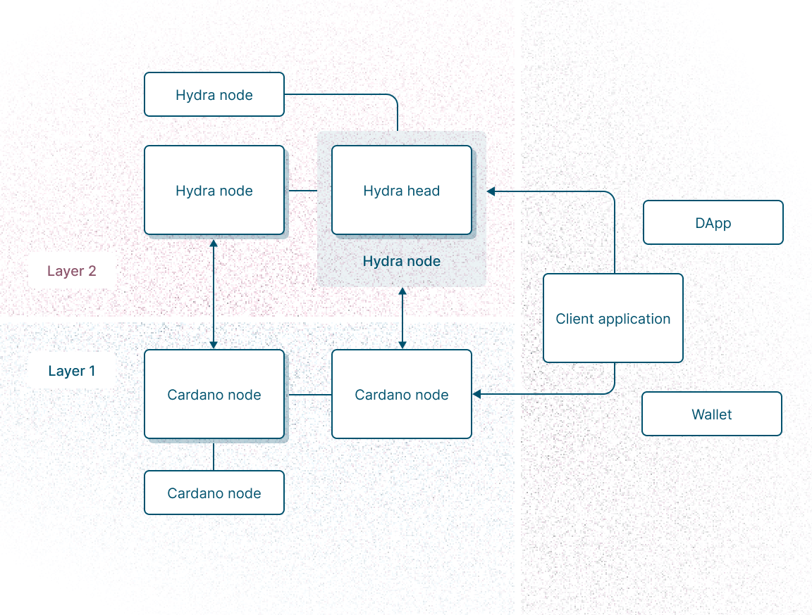
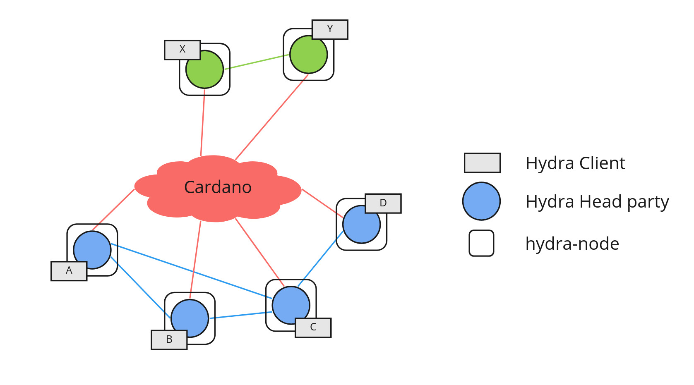

# **Khám phá chuyên sâu kiến trúc Hydra**

**Cách các Head, Participant và Channel phối hợp để mang lại khả năng mở rộng và giao dịch tức thì trên Cardano**

---

## Giới thiệu

**Hydra** là một **giải pháp Layer-2 dành cho Cardano**, được phát triển để **tối ưu hóa hiệu suất giao dịch** và mở rộng khả năng của các ứng dụng phi tập trung (DApps) mà không hy sinh tính **bảo mật, finality và decentralization** vốn có của Layer-1.

Hydra cho phép các giao dịch diễn ra **gần như tức thì**, giảm phí đáng kể, tăng **throughput**, đồng thời vẫn **neo vào Layer-1** để đảm bảo mọi thay đổi đều chính xác, minh bạch và an toàn.

Nếu hình dung **Cardano Layer-1** như **trục chính của một thành phố**, nơi mọi giao dịch đều được ghi lại cẩn thận và không thể thay đổi, thì **Hydra** là **hệ thống các tuyến đường song song tốc độ cao**, nơi các giao dịch diễn ra ngay lập tức nhưng vẫn được đồng bộ hóa với trục chính này.

Nhờ thiết kế này, Hydra mở ra khả năng cho các ứng dụng Web3 thời gian thực, chẳng hạn như:

- **Gaming:** giao dịch vật phẩm, token trong game gần như tức thời.
- **Real-time tipping:** gửi tiền trực tiếp đến creator mà không cần chờ block.
- **Micro-payments:** thanh toán nhỏ lẻ với chi phí tối thiểu.
- **DEX L2 orderbook:** khớp lệnh off-chain, giảm tắc nghẽn trên L1.
- **IoT payments & Collaborative apps:** thanh toán giữa thiết bị và ứng dụng đa người dùng với trạng thái đồng bộ tức thì.

Hydra không chỉ tập trung vào tốc độ mà còn đảm bảo **finality, bảo mật và decentralization**, tạo ra một nền tảng Layer-2 đáng tin cậy cho toàn bộ hệ sinh thái Cardano.

---

## Tại Sao Hydra Tồn Tại

**Cardano Layer-1 (L1)** được xây dựng với mục tiêu tối ưu hóa **bảo mật, tính chính xác và finality**. Mọi giao dịch trên Cardano L1 đều được ghi lại trên ledger một cách minh bạch, bất biến và có thể xác minh. Hợp đồng thông minh thực thi đúng các quy tắc định sẵn, đảm bảo rằng mọi hành vi gian lận đều bị loại bỏ ngay từ gốc. Đây chính là lý do Cardano được đánh giá cao về **an toàn và tính chính xác** trong thế giới blockchain.

Tuy nhiên, chính các đặc điểm bảo mật mạnh mẽ này cũng tạo ra **những hạn chế về hiệu năng**, đặc biệt khi so sánh với nhu cầu của các ứng dụng thời gian thực:

- **Throughput thấp (TPS thấp):** Layer-1 chỉ đạt khoảng 250 giao dịch mỗi giây (Transactions Per Second), một con số chưa đủ cho các ứng dụng cần tốc độ cao hoặc chịu tải lớn.
- **Block time dài:** Một block trung bình mất khoảng 20 giây để xác nhận, làm cho trải nghiệm người dùng trong các ứng dụng real-time như game hoặc micro-payments bị chậm và gián đoạn.
- **Chi phí giao dịch cao đối với micro-transactions:** Mặc dù phí giao dịch ổn định, nhưng đối với các giao dịch nhỏ lẻ (ví dụ: gửi tip vài ADA hoặc thanh toán trong game), chi phí này có thể vượt quá giá trị giao dịch, gây khó khăn cho người dùng.

Những hạn chế trên khiến **Layer-1 không phù hợp cho các ứng dụng cần tốc độ cao và thời gian thực**, bao gồm:

- **Gaming:** kinh tế trong game, giao dịch vật phẩm, hay thanh toán giữa người chơi cần tốc độ gần như tức thì.
- **Streaming payments / Real-time tipping:** gửi tiền ngay lập tức cho creator hoặc dịch vụ theo thời gian thực.
- **DEX L2 orderbooks:** cần khớp lệnh nhanh để tránh trượt giá và tắc nghẽn.
- **IoT payments và collaborative apps:** thiết bị IoT hoặc ứng dụng multi-user cần cập nhật trạng thái liên tục và tức thời.

Để giải quyết những vấn đề này, **Hydra được phát triển như một Layer-2 dành riêng cho Cardano**. Hydra không chỉ giúp tăng tốc độ giao dịch mà còn đảm bảo **an toàn và finality nhờ neo trực tiếp vào Layer-1**. Cụ thể:

- **Tăng TPS vượt trội:** Hydra sử dụng cơ chế **giao dịch off-chain** thông qua các “Hydra Head” — mini-ledger cho nhóm participant. Mỗi Head vận hành độc lập, cho phép mở nhiều Head song song, giúp throughput tổng thể tăng gần như tuyến tính mà không ảnh hưởng đến Layer-1.
- **Độ trễ gần bằng không:** Các giao dịch diễn ra tức thì trong Hydra Head, gần như không phải chờ block, mang lại trải nghiệm real-time cho người dùng.
- **Bảo mật và finality:** Mọi Head khi đóng đều gửi snapshot cuối cùng lên Layer-1 để xác nhận. Điều này đảm bảo rằng tất cả thay đổi đều minh bạch, hợp pháp, và có thể phục hồi trong trường hợp có tranh chấp hoặc sự cố.
- **Chi phí giao dịch thấp:** Vì các giao dịch off-chain không phải trả phí L1 cho mỗi hành động, micro-transactions trở nên khả thi và kinh tế hơn.
- **Khả năng mở rộng theo chiều ngang:** Mỗi Head là một kênh giao dịch độc lập. Khi mở nhiều Head song song, hệ thống có thể xử lý hàng nghìn TPS mà vẫn giữ an toàn nhờ Layer-1.

Tóm lại, **Hydra là lớp tăng tốc đáng tin cậy cho Cardano**, vừa giữ được sự **tin cậy và an toàn của Layer-1**, vừa đáp ứng **nhu cầu tốc độ, real-time và mở rộng** cho các ứng dụng Web3 hiện đại. Nó tạo ra một môi trường mà các giao dịch gần như tức thì, micro-payments khả thi, và các ứng dụng phi tập trung có thể vận hành mượt mà, an toàn và hiệu quả.

> Nếu ví Cardano Layer-1 như **trục chính của thành phố**, thì Hydra chính là **hệ thống các tuyến đường song song tốc độ cao**, nơi các giao dịch diễn ra ngay lập tức nhưng vẫn được đồng bộ hóa với trục chính này, đảm bảo **finality, bảo mật và minh bạch**.

---

## Khái niệm cốt lõi

Hydra không phải là một **sidechain** hay một dạng **rollup** thông thường. Thay vào đó, Hydra là một **State-Channel Framework** được thiết kế đặc biệt dành cho Cardano, nhằm mở rộng khả năng xử lý giao dịch mà vẫn duy trì **tính an toàn và finality** của Layer-1.

### Hydra Head

Trái tim của Hydra là **Hydra Head** — một “mini-ledger” riêng biệt cho một nhóm participant. Mỗi Head là một kênh off-chain, nơi các participant có thể giao dịch trực tiếp với nhau mà không phải chờ các block của Layer-1.

- **Mini-ledger riêng:** Mỗi Head hoạt động như một bản sao ledger cho nhóm participant, ghi nhận mọi thay đổi trạng thái một cách minh bạch và có thể xác minh.
- **Giao dịch tốc độ cao:** Mọi giao dịch trong Head gần như tức thì, với chi phí gần như bằng 0, nhờ loại bỏ các bước xác nhận block trên Layer-1.
- **Throughput cực cao:** Vì mỗi Head hoạt động độc lập, mở nhiều Head song song cho phép tăng TPS tổng thể lên hàng nghìn giao dịch mỗi giây mà Layer-1 không thể đạt được.

### Giao dịch Off-Chain

Trong Hydra Head, các giao dịch diễn ra hoàn toàn **off-chain** nhưng vẫn được đảm bảo an toàn:

- **Kiểm tra và đồng thuận:** Mỗi giao dịch được Hydra Node của participant xác nhận và ký chữ ký, đảm bảo rằng tất cả thành viên đồng ý với trạng thái mới.
- **Snapshot trạng thái:** Các Hydra Head liên tục tạo snapshot của trạng thái hiện tại, được ký bởi tất cả participant. Snapshot này có thể phục hồi nếu có node mất kết nối hoặc xảy ra tranh chấp.

### Finality trên Layer-1

Dù giao dịch diễn ra off-chain, **finality vẫn được đảm bảo** nhờ cơ chế đồng bộ với Layer-1:

- Khi một Hydra Head đóng lại, trạng thái cuối cùng (snapshot) được gửi lên **Cardano Layer-1** để xác nhận.
- Layer-1 đảm bảo mọi thay đổi đều **minh bạch, hợp pháp và không thể gian lận**, tạo ra sự an toàn tuyệt đối.

### Lợi ích chính

Nhờ cơ chế này, Hydra mang lại nhiều lợi ích quan trọng:

1. **Tốc độ tức thì:** Off-chain transactions gần như không độ trễ.
2. **Phí thấp:** Mở ra khả năng thực thi micro-transactions.
3. **Mở rộng theo chiều ngang:** Nhiều Head hoạt động song song → TPS tổng thể tăng.
4. **An toàn và tin cậy:** Mọi giao dịch quan trọng vẫn neo vào Layer-1, đảm bảo finality và bảo mật.
5. **Ứng dụng real-time:** Thích hợp cho game, tipjar, DEX L2 orderbook, IoT payments và collaborative apps.

> Nói cách khác, Hydra cho phép khai thác **tốc độ của off-chain** nhưng vẫn giữ **sự tin cậy và finality của Layer-1**, mở ra khả năng xây dựng các ứng dụng phi tập trung **real-time** mà Layer-1 không thể đáp ứng.

---

## Các thành phần chính

Hydra được xây dựng dựa trên ba thành phần trung tâm, mỗi thành phần đóng một vai trò quan trọng nhưng phối hợp chặt chẽ để tạo ra một hệ thống Layer-2 tốc độ cao và vẫn an toàn:

### 1. Cardano Node (Layer-1 Anchor)

Cardano Node là **nền móng Layer-1**, nơi mọi giao dịch cuối cùng được ghi nhận và xác thực. Đây là điểm neo bảo mật của toàn bộ hệ thống Hydra.

- **Ledger gốc & Finality:** Cardano Node giữ sổ cái chính, đảm bảo mọi thay đổi trạng thái đều được ghi lại một cách chính xác và không thể gian lận.
- **Xác thực giao dịch quan trọng:** Bao gồm Open (mở Hydra Head), Commit (khóa tài sản), Close (đóng Head), Fanout (phân phối tài sản cuối cùng).
- **Khóa tài sản:** Khi participant commit tài sản vào Hydra Head, Cardano Node sẽ khóa tài sản trên L1 để đảm bảo rằng các giao dịch off-chain không thể bị gian lận hoặc trùng lặp.
- **Điểm neo bảo mật:** Dù Hydra xử lý giao dịch off-chain với tốc độ cao, finality và an toàn cuối cùng vẫn phụ thuộc vào Cardano Node.

> Nói cách khác, nếu Hydra là một mạng đường cao tốc song song, thì Cardano Node là **tuyến quốc lộ chính**, nơi mọi giao dịch quan trọng đều phải quay về để xác nhận và bảo đảm an toàn.

### 2. Hydra Node (Off-Chain Engine)

Hydra Node là **trung tâm thần kinh off-chain**, được vận hành bởi mỗi participant để quản lý giao dịch trong Hydra Head.

- **Điều phối giao dịch off-chain:** Nhận, xử lý và phát tán giao dịch đến các Hydra Node khác trong cùng Head.
- **Quản lý snapshot:** Ghi lại trạng thái hiện tại của Head, ký xác nhận, và cho phép phục hồi khi một node bị mất kết nối.
- **Cầu nối giữa Layer-1 và Layer-2:** Hydra Node kết nối Cardano Node chậm nhưng an toàn với Head tốc độ cao, đảm bảo mọi giao dịch off-chain vẫn có thể chứng thực trên Layer-1.
- **Đồng thuận và bảo mật:** Mỗi Hydra Node xác nhận các giao dịch, ký chữ ký số, đảm bảo mọi participant đồng ý với trạng thái hiện tại của Head.
- **Thực thi smart contract off-chain:** Hydra Node xử lý các logic hợp đồng, rules, và điều kiện giao dịch ngay trong Head mà không cần chờ L1, giúp giao dịch gần như tức thì.
- **Đồng thuận trạng thái:** Mỗi thay đổi do smart contract off-chain tạo ra đều được ký bởi tất cả participant trước khi snapshot được gửi lên Cardano.

> Hydra Node đảm bảo rằng **tốc độ và an toàn cùng tồn tại**, biến Head thành mini-ledger off-chain với khả năng xử lý gần như tức thì.

### 3. Hydra Head (Local Shared Ledger)

Hydra Head là **không gian giao dịch off-chain riêng**, nơi mọi participant có thể trao đổi giá trị và thực hiện logic hợp đồng thông minh với tốc độ cao.

- **Mini-ledger cho nhóm participant:** Mỗi Head là một kênh off-chain độc lập, ghi nhận trạng thái và giao dịch của các participant trong Head.
- **Chứa ADA, native tokens và logic off-chain:** Head có thể xử lý nhiều loại tài sản và thực thi logic hợp đồng mà không phụ thuộc vào block time của Layer-1.
- **Quy trình giao dịch:** Mở Head bằng giao dịch L1, xử lý tất cả giao dịch off-chain, và kết thúc Head bằng giao dịch L1 để đảm bảo finality.
- **Hiệu năng cao:** Giao dịch trong Head gần như tức thì, TPS cao, chi phí thấp, nhưng vẫn đảm bảo an toàn nhờ cơ chế đồng bộ với Layer-1.

> Hydra Head là **đường cao tốc riêng** cho participant: nhanh, linh hoạt, hiệu quả, và vẫn giữ toàn vẹn dữ liệu nhờ sự phối hợp với Cardano Node.

---

Như vậy, ba thành phần này phối hợp nhịp nhàng:

- **Cardano Node** giữ sự thật cuối cùng và bảo mật,
- **Hydra Node** điều phối và đảm bảo đồng thuận off-chain,
- **Hydra Head** tạo ra không gian giao dịch tốc độ cao.

Sự kết hợp này tạo ra một **Layer-2 mạnh mẽ, an toàn và mở rộng**, giúp Cardano đáp ứng các ứng dụng real-time mà Layer-1 không thể thực hiện một cách hiệu quả.

---

## Mối quan hệ giữa Layer-1 và Layer-2

Hydra thiết kế Layer-2 (L2) như một hệ thống mở rộng cho Layer-1 (L1) của Cardano, nhằm mang lại **tốc độ và khả năng mở rộng** mà vẫn giữ **finality và bảo mật**.

- **Layer-1 (Cardano Node):**

  - Là sổ cái gốc, giữ tất cả dữ liệu giao dịch cuối cùng.
  - Xác thực các giao dịch quan trọng: Open, Commit, Close, Fanout.
  - Thực thi **smart contract on-chain** để khóa tài sản, đảm bảo tính toàn vẹn và tránh gian lận.
  - Cung cấp **finality cuối cùng**, mọi trạng thái off-chain cuối cùng đều được đồng bộ lên L1.

- **Layer-2 (Hydra Node / Hydra Head):**

  - Không gian giao dịch off-chain tốc độ cao, xử lý TPS lớn và độ trễ gần như bằng 0.
  - Thực thi **smart contract off-chain**, quản lý rules và logic phức tạp ngay trong Hydra Head.
  - Hydra Node điều phối các giao dịch giữa participant, ký xác nhận trạng thái và tạo snapshot.
  - Hoạt động độc lập, nhưng các snapshot cuối cùng được commit lên L1 để đảm bảo tính minh bạch và bảo mật.

- **Điểm tương tác quan trọng giữa L1 và L2:**

1. **Init:** Khởi tạo Hydra Head, xác nhận participant và chuẩn bị tài sản.
2. **Commit:** Khóa tài sản từ participant vào Head.
3. **Close:** Gửi snapshot cuối cùng của Head lên L1, cho phép tranh chấp nếu cần.
4. **Fanout:** Phân phối tài sản trở lại các participant dựa trên snapshot cuối cùng.

- **Tóm lại:**
  - L1 là trụ cột an toàn, giữ finality và bảo mật.
  - L2 là cánh tay tốc độ, xử lý giao dịch gần như tức thì.
  - Hydra kết hợp cả hai để cung cấp **tốc độ, khả năng mở rộng, an toàn, và decentralization**, cho phép thực hiện các ứng dụng real-time mà Layer-1 chưa thể đáp ứng.

---

## Luồng giao dịch trong Hydra

Hydra vận hành giao dịch theo chu trình 5 pha, đảm bảo **tốc độ cao** nhờ off-chain nhưng vẫn giữ **bảo mật và finality** từ Layer-1.

1. **Init (Khởi tạo Hydra Head):**

   - Giao dịch Open được thực hiện trên Cardano Layer-1.
   - Xác nhận tất cả participant hợp lệ.
   - Tạo không gian off-chain riêng cho nhóm participant.
   - **Smart contract on-chain:** đảm bảo chỉ participant được phép tham gia và xác nhận quyền sở hữu tài sản.

2. **Commit (Nạp tài sản):**

   - Mỗi participant deposit ADA hoặc native tokens vào Head.
   - Layer-1 khóa tài sản, đảm bảo không bị sử dụng ngoài Head.
   - **Smart contract on-chain:** giữ tài sản an toàn, tạo điểm neo bảo mật cho các giao dịch off-chain.

3. **Open (Giao dịch off-chain tốc độ cao):**

   - Tất cả giao dịch diễn ra off-chain, gần như tức thì.
   - Hydra Node quản lý snapshot liên tục, ký xác nhận từ tất cả participant.
   - **Smart contract off-chain:** đảm bảo quy tắc giao dịch, kiểm tra tính hợp lệ và đồng thuận giữa participant.
   - TPS cực cao, không phụ thuộc block time của L1.

4. **Close (Kết thúc Head):**

   - Participant gửi snapshot cuối cùng lên Layer-1.
   - **Contestation period:** khoảng thời gian để phản đối nếu có bất kỳ tranh chấp hoặc sai lệch nào.
   - L1 xác nhận snapshot cuối cùng.
   - **Smart contract on-chain:** bảo vệ tính toàn vẹn, đảm bảo finality và chống gian lận.

5. **Fanout (Phân phối tài sản):**
   - Layer-1 đọc snapshot đã xác nhận.
   - Phân phối ADA, tokens hoặc tài sản commit trở lại participant.
   - Hydra Head chính thức đóng, mọi giao dịch off-chain được hợp nhất minh bạch với L1.

**Tóm lại:** Chu trình này cho phép Hydra vừa giữ tốc độ gần như tức thì, vừa đảm bảo an toàn, finality và khả năng phục hồi nếu có gián đoạn hoặc tranh chấp.

---

## Lợi ích chính

## Lợi ích chính của Hydra

Hydra mang đến nhiều lợi ích nổi bật cho hệ sinh thái Cardano, vừa tăng tốc giao dịch, vừa đảm bảo an toàn và decentralization:

- **Giao dịch gần như tức thì:**

  - Nhờ cơ chế off-chain trong Hydra Head, các giao dịch diễn ra ngay lập tức.
  - Người dùng không phải chờ block 20 giây như trên Layer-1.
  - Thích hợp cho các ứng dụng yêu cầu tốc độ cao như game, thanh toán streaming hoặc tipjar.

- **Phí cực thấp:**
  - Giao dịch off-chain tiêu tốn phí tối thiểu.
  - Mở ra khả năng micro-transactions, giúp ứng dụng như IoT payments, in-game transactions hay real-time tipping khả thi.
- **Khả năng mở rộng theo chiều ngang:**

  - Mỗi Hydra Head hoạt động độc lập.
  - Khi mở nhiều Head song song, tổng TPS tăng gần như tuyến tính.
  - Giúp Cardano đáp ứng nhu cầu giao dịch lớn mà không ảnh hưởng đến Layer-1.

- **Bảo mật neo vào Layer-1:**

  - Mọi kết quả quan trọng đều được final trên Cardano.
  - Hydra vừa tận dụng tốc độ off-chain, vừa giữ được tính toàn vẹn, bảo mật và decentralization của Layer-1.

- **Use cases thực tế:**
  - **Gaming:** Giao dịch vật phẩm nhanh, kinh tế trong game hiệu quả.
  - **Real-time tipping:** Gửi tiền ngay lập tức cho creator hoặc user khác.
  - **DEX L2 orderbook:** Off-chain order matching, giảm tắc nghẽn mạng và phí.
  - **IoT payments:** Thanh toán giữa thiết bị, giao dịch nhỏ, phí thấp.
  - **Collaborative apps:** Multi-user apps, cập nhật trạng thái tức thì giữa nhiều user.

Hydra trở thành **mạch tăng tốc đáng tin cậy** cho Cardano, mở ra thế giới ứng dụng real-time mà vẫn duy trì **an toàn, finality và decentralization**, đồng thời mở rộng khả năng xử lý giao dịch mà Layer-1 không thể đáp ứng.

---
