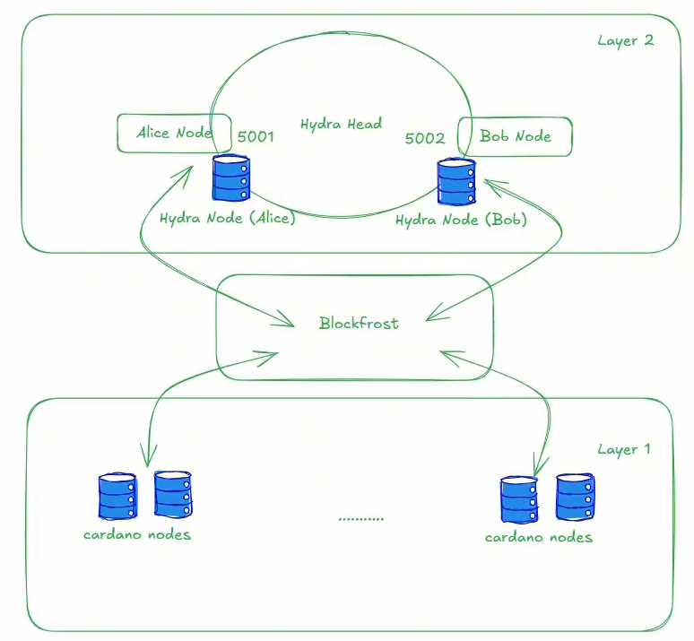

<div align="center">


# **Khắc phục sự cố Hydra Nodes**

**Phân tích chi tiết các lỗi thường gặp trong quá trình vận hành Hydra Nodes, lý giải cơ chế gây lỗi ở từng tầng hệ thống và hướng dẫn cách xử lý đúng chuẩn để đảm bảo hoạt động ổn định và liên tục**

[](https://ubuntu.com/)
[](https://github.com/IntersectMBO/cardano-node)
[](https://hydra.family)
[](https://systemd.io/)
[](https://creativecommons.org/licenses/by-sa/4.0/)

---

</div>

## 📌 Giới thiệu

Nhận diện các lỗi thường gặp khi triển khai và vận hành Hydra Node.
Phân tích nguyên nhân lỗi theo từng tầng, từ L1 Cardano đến L2 Hydra.
Áp dụng quy trình xử lý chuẩn dựa trên log và công cụ debug realtime.
Đảm bảo Hydra Head mở/đóng an toàn và giao dịch L2 hoạt động ổn định.

---

## 🎯 Mục tiêu

Sau khi nghiên cứu và thực hành theo tài liệu này, người học sẽ đạt được:

- **Khả năng định danh lỗi:** Phân biệt chính xác lỗi do hạ tầng (Layer 1) hay lỗi do giao thức (Layer 2).
- **Kỹ năng phân tích đa tầng:** Thấu hiểu mối quan hệ cộng sinh giữa Cardano Node và Hydra Node.
- **Quy trình xử lý chuẩn (SOP):** Sử dụng thành thạo các công cụ Debug (Log, WebSocket, CLI) để khôi phục hệ thống.
- **Vận hành an toàn:** Đảm bảo toàn bộ vòng đời của Hydra Head diễn ra thông suốt, bảo vệ tính toàn vẹn của tài sản.

---

## 🏗️ 2. Nhận Diện Lỗi Tầng Layer 1 (Cardano Infrastructure)

Layer 1 là nền tảng. Nếu Cardano Node gặp sự cố, Hydra Node sẽ bị "mất liên lạc" với sổ cái chính.

### 2.1. Lỗi Biến Môi Trường Socket (`node.socket`)

- **Triệu chứng:** Khi chạy lệnh `cardano-cli query tip`, hệ thống báo lỗi: `ConnectException: "node.socket": directional link failure`.
- **Nguyên nhân:** CLI không tìm thấy file giao tiếp giữa các tiến trình (IPC) do biến `CARDANO_NODE_SOCKET_PATH` chưa được thiết lập.
- **Giải pháp chi tiết:**
  1. Kiểm tra biến môi trường: `echo $CARDANO_NODE_SOCKET_PATH`.
  2. Nếu trống, hãy tìm vị trí file socket thực tế và cấu hình vào file cá nhân:

     ```bash
     echo 'export CARDANO_NODE_SOCKET_PATH=/đường/dẫn/đến/node.socket' >> ~/.bashrc
     source ~/.bashrc
     ```

### 2.2. Lỗi Đồng Bộ Hóa (Synchronization)

- **Triệu chứng:** Hydra Node báo lỗi không tìm thấy Point (Block) khởi tạo hoặc giao dịch bị treo.
- **Nguyên nhân:** Cardano Node chưa đạt trạng thái `syncProgress: 100%`.
- **Kiểm tra:** ```bash
  cardano-cli query tip --testnet-magic 2
  ```
  *Lưu ý: Luôn đợi Node L1 đồng bộ hoàn toàn trước khi khởi chạy Hydra Node.*
  ```

### 2.3. Giải Pháp Tối Ưu: API Layer (Blockfrost)

- **Tình huống:** Nếu tài nguyên máy chủ (RAM/CPU) không đủ để chạy Cardano Node, bạn có thể sử dụng giải pháp API.
- **Cách thực hiện:** Sử dụng tham số `--node-api-variant-blockfrost` kết hợp với API Key để thay thế cho việc chạy Node cục bộ.



---

## 🌀 3. Nhận Diện Lỗi Tầng Layer 2 (Hydra Protocol)

### 3.1. Lỗi "No Seed Input" (Thiếu Fuel)

- **Triệu chứng:** Gửi lệnh `init` nhưng nhận lại thông báo lỗi `PostChainTxError`.
- **Bản chất:** Hydra Node cần một lượng ADA làm "nhiên liệu" (Fuel) để thực hiện các giao dịch điều khiển trên Layer 1 (Smart Contract).
- **Xử lý:** Kiểm tra ví vận hành của Node. Mỗi Node (Alice, Bob...) cần ít nhất **100 ADA** trong ví nội bộ để sẵn sàng cho các thao tác `init`, `commit`, `close`.

### 3.2. Lỗi Commit Tài Sản (Commit Validation)

- **Triệu chứng:** Không thể thực hiện nạp tài sản hoặc file giao dịch commit sinh ra bị trống.
- **Nguyên nhân:** Ở trạng thái `Initializing`, nốt chỉ tiếp nhận commit từ chính ví của nó thông qua cổng API tương ứng.
- **Quy tắc vận hành:**
  - **Alice:** Phải gửi lệnh commit qua Port 4001.
  - **Bob:** Phải gửi lệnh commit qua Port 4002.
  - _Cấm kỵ:_ Không commit chéo cổng hoặc commit nhiều lần trong một phiên làm việc.

### 3.3. Lỗi Thời Gian Tranh Chấp (Contestation Period)

- **Triệu chứng:** Gửi lệnh `fanout` ngay sau khi `close` nhưng bị hệ thống từ chối.
- **Nguyên nhân:** Sau khi đóng Head, mạng lưới cần một khoảng thời gian chờ (mặc định 600 slot ~ 10 phút) để các bên kiểm tra tính trung thực của Snapshot cuối cùng.
- **Cách xử lý:** 1. Theo dõi Log hệ thống. 2. Chỉ thực hiện lệnh `fanout` khi Log xuất hiện thông báo: `ReadyToFanout`.

---

## 🛠️ 4. Quy Trình Debug Chuẩn Cho Người Học (SOP)

Để trở thành một người vận hành chuyên nghiệp, hãy tuân thủ quy trình 4 bước sau khi gặp sự cố:

1.  **Kiểm tra Trạng thái Tiến trình:** Sử dụng `tmux ls` hoặc `ps -ef | grep hydra` để đảm bảo các nốt đang thực sự chạy ngầm.
2.  **Giám sát Log Real-time:** Kết nối vào WebSocket của Hydra để quan sát các thông điệp JSON. Đây là nguồn thông tin chính xác nhất về trạng thái hiện tại (`Idle`, `Initializing`, `Open`, `Closed`).
3.  **Xác thực Tài sản (UTXO):** Luôn dùng lệnh `cardano-cli query utxo` để kiểm tra ví trước và sau mỗi bước quan trọng.
4.  **Kiểm tra Tham số Cấu hình:** Rà soát kỹ các tham số khởi chạy như `--hydra-scripts-tx-id` và `--cardano-verification-key` để đảm bảo không có sự sai lệch giữa các nốt.

---

<div align="center">

## 📚 **Tài liệu tham khảo**

**Tóm tắt các bài học quan trọng và chuẩn bị nền tảng vững chắc để bước vào giai đoạn phát triển Hydra DApp một cách an toàn, ổn định và hiệu quả.**

<p>

<a href="https://lms.cardano2vn.io/courses/hydra-on-cardano-complete-step-by-step-dapp-guide/lesson/introduction-to-hydra-exploring-the-future-of-cardanos-layer-2-scaling-and-practical-use-cases"></a>
<a href="YOUR_SLIDES_LINK"></a>
<a href="YOUR_GITHUB_LINK"></a>
<a href="YOUR_ARTICLE_LINK"></a>
<a href="YOUR_YOUTUBE_LINK"></a>

</p>

</div>
