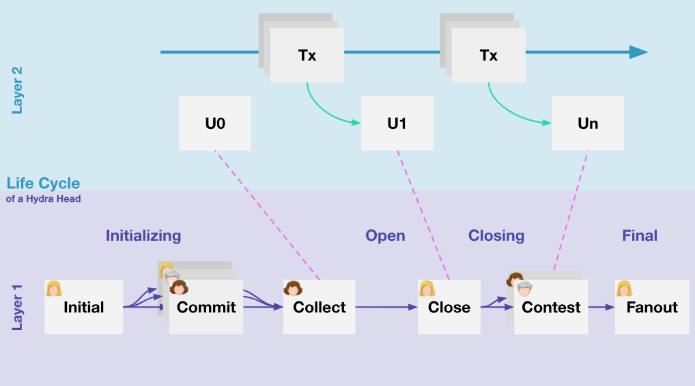

# **Đánh giá và Chuẩn bị**

**Tóm tắt các bài học quan trọng và chuẩn bị nền tảng vững chắc để bước vào giai đoạn phát triển Hydra DApp một cách an toàn, ổn định và hiệu quả.**

---

## 📌 Giới thiệu

Phần này tập trung vào việc tổng hợp và củng cố các kiến thức nền tảng quan trọng trước khi bước vào xây dựng một DApp thực tế trên Hydra.

Cụ thể, nội dung bao gồm:

- 🔁 Ôn tập và hệ thống hóa kiến thức cốt lõi
  Làm rõ toàn bộ quy trình xây dựng và vận hành một Hydra Head, từ khởi tạo, commit tài sản, mở head cho đến khi đóng và fan-out về Layer 1.
- 🌐 Cấu hình và expose Hydra Node trên VPS
  Hướng dẫn cách thiết lập môi trường, mở port và export địa chỉ IP để cho phép các ứng dụng bên ngoài (frontend/DApp) có thể kết nối trực tiếp tới Hydra Node thông qua API.
- ⚖️ So sánh với các giải pháp Layer 2 khác
  Phân tích sự khác biệt giữa Hydra và các giải pháp tiêu biểu như Lightning Network (Bitcoin), nhằm làm rõ:
  - Sự khác biệt trong kiến trúc (multi-party vs payment channel).
  - Cách quản lý trạng thái (full ledger vs balance-based).
  - Khả năng mở rộng và lập trình (smart contract vs micropayment)

---

## 🎯 Mục tiêu

Sau khi hoàn thành phần này, bạn sẽ có được một nền tảng kiến thức vững chắc để bước vào giai đoạn xây dựng DApp thực tế trên Hydra, bao gồm:

- 🔍 Hiểu rõ cách một Hydra Head hoạt động trong thực tế
  Bạn sẽ nắm được toàn bộ vòng đời của một Hydra Head, từ giai đoạn khởi tạo (init), commit tài sản từ Layer 1, mở head để thực hiện giao dịch off-chain, cho đến khi đóng head và fan-out trạng thái cuối cùng về lại blockchain. Đồng thời, bạn cũng hiểu được cách các bên tham gia tương tác và đồng thuận với nhau trong môi trường Hydra.
- ⚙️ Biết cách triển khai và expose Hydra Node trên môi trường VPS
  Bạn sẽ có khả năng tự thiết lập một hệ thống Hydra Node chạy trên VPS, cấu hình các port cần thiết, mở firewall và export địa chỉ IP để cho phép truy cập từ bên ngoài. Điều này giúp bạn đưa Hydra từ môi trường local lên môi trường thực tế, sẵn sàng cho việc tích hợp với các ứng dụng khác.
- 🔗 Nắm được cách tích hợp Hydra với ứng dụng bên ngoài (DApp/Frontend)
  Bạn sẽ hiểu cách các ứng dụng client (frontend hoặc backend) giao tiếp với Hydra thông qua API, từ đó có thể xây dựng các DApp có khả năng gửi giao dịch, truy vấn trạng thái và tương tác trực tiếp với Hydra Head một cách mượt mà, thay vì thao tác thủ công qua terminal.
- ⚖️ Phân biệt rõ Hydra với các giải pháp Layer 2 khác
  Không chỉ dừng lại ở việc sử dụng, bạn còn hiểu sâu về sự khác biệt giữa Hydra và các giải pháp như Lightning Network, thông qua các khía cạnh quan trọng:
  Kiến trúc: Hydra sử dụng mô hình multi-party state channel với shared state, trong khi Lightning sử dụng payment channel giữa hai bên.
- Use case: Hydra phù hợp cho các DApp phức tạp (DeFi, NFT, logic on-chain), còn Lightning tối ưu cho thanh toán nhanh (micropayment).
- Khả năng mở rộng: Hydra cho phép xử lý nhiều giao dịch với logic phức tạp trong một head, trong khi Lightning mở rộng thông qua mạng lưới routing toàn cầu.

---

## 🏗️ Ôn tập và hệ thống hóa kiến thức

### 🔁 Cài đặt cấu hình Hydra Head

### 🏗️ Vòng đời thực sự của Hydra Head

Hydra Head là một mô hình off-chain scaling trên Cardano, nơi các giao dịch được thực hiện ngoài blockchain nhưng vẫn đảm bảo tính nhất quán và an toàn. Mỗi Hydra Head vận hành theo một chuỗi trạng thái tuần tự, từ khi khởi tạo cho đến khi hoàn tất settlement trên blockchain. Hiểu rõ vòng đời này là chìa khóa để vận hành Hydra Node hiệu quả và xử lý các sự cố nhanh chóng.

Dưới đây là mô tả chi tiết từng trạng thái trong vòng đời Hydra Head:

1. Idle – Trạng thái chờ

- Đây là trạng thái mặc định của Node trước khi Hydra Head được tạo.
- Node không thực hiện bất kỳ giao dịch nào và chỉ lắng nghe tín hiệu từ các participant để mở Head mới.
- Trong trạng thái Idle, Node đảm bảo rằng tất cả các tài nguyên (UTxOs, bộ nhớ, kết nối mạng) đều sẵn sàng cho việc khởi tạo Head.
- Lưu ý vận hành: Một Node bị treo lâu ở Idle thường do vấn đề network hoặc participant không gửi tín hiệu khởi tạo, cần kiểm tra kết nối và logs.

2. Init (Initialization) – Khởi tạo Hydra Head

- Khi participant quyết định mở Head, Node chuyển sang trạng thái Init.
- Trong giai đoạn này, Node sẽ xác nhận danh sách participant, commit tài sản (UTxOs) từ Layer 1 và thiết lập các quy tắc giao dịch off-chain.
- Các bước chính trong Init:
  - Xác định danh sách participant: tất cả Operators và Delegators phải được liệt kê chính xác.
  - Cấu hình UTxOs ban đầu: các UTxO của participant được commit tạm thời để đảm bảo tài sản có thể dùng cho giao dịch off-chain.
  - Thiết lập rules và timeout: bao gồm số lượng transaction tối đa, thời gian chờ, và các quy tắc xác nhận giao dịch.
- Lưu ý vận hành: Nếu có participant thiếu commit UTxO hoặc cấu hình không hợp lệ, Node sẽ không thể chuyển sang trạng thái tiếp theo, dẫn đến lỗi Init. Cần kiểm tra logs để xác định participant nào gây lỗi và xử lý kịp thời.
- Điểm quan trọng: Nếu participant thiếu commit UTxO hoặc cấu hình không hợp lệ, Head sẽ không thể tiến sang trạng thái tiếp theo.

Ví dụ thực tế: Một Node mới tham gia nhưng chưa đồng bộ blockchain có thể gây lỗi Init vì Node không nhận được UTxO hợp lệ từ participant khác.

3. Commit – Cam kết tài sản

- Trạng thái này yêu cầu mọi participant commit UTxOs của họ vào Hydra Head.
- Commit là bước quan trọng để đảm bảo rằng mọi participant đều đồng ý về tài sản sẽ được sử dụng trong giao dịch off-chain.
- Nếu có participant nào không commit hoặc commit không hợp lệ, Head không thể mở và sẽ cần xử lý lỗi hoặc hủy Head.
- Kiểm soát lỗi phổ biến: UTxO không tồn tại hoặc bị khóa. Participant offline hoặc mất kết nối. Khác phiên bản Node (version mismatch) gây lỗi signature.
- Ý nghĩa vận hành: Commit là cơ chế atomicity: mọi participant phải commit thành công, nếu không Head không thể mở, tránh trường hợp một số participant bị mất lợi ích hoặc dữ liệu off-chain bị thiếu.

4. Open – Mở Hydra Head và thực hiện giao dịch off-chain

- Khi tất cả participant đã commit, Head chuyển sang trạng thái Open.
- Trong Open:
  - Các giao dịch off-chain được tạo, ký và broadcast giữa các participant mà không cần ghi lên blockchain.
  - Mỗi participant duy trì một state đồng bộ, bao gồm số dư và lịch sử giao dịch.
  - Node liên tục kiểm tra signature, state hash, và network latency để đảm bảo tính nhất quán.
- Lưu ý quan trọng:
  - Nếu participant offline hoặc mất đồng bộ, Head có thể bị treo.
  - Giao dịch sai cú pháp hoặc vượt quá số dư sẽ bị từ chối.
- Cách xử lý lỗi Open: Restart Node, resync state từ các participant khác hoặc fallback sang trạng thái Close để commit lên blockchain.

5. Close – Đóng Head

- Khi Head hoàn thành mục tiêu giao dịch hoặc hết thời gian, Node chuyển sang trạng thái Close.
- Trong Close:
  - Tất cả các giao dịch off-chain được tổng hợp lại.
  - Giao dịch chưa được commit sẽ bị hủy để đảm bảo tính nhất quán.
  - Participant chuẩn bị dữ liệu để đẩy lên blockchain.
- Các vấn đề thường gặp:
  - Node mất kết nối mạng khi Close, dẫn đến Head bị treo.
  - Signature không hợp lệ, không thể xác nhận giao dịch cuối cùng.

Điểm lưu ý: Close là bước quyết định tính hợp lệ và an toàn của tất cả giao dịch off-chain. Nếu có lỗi trong quá trình này, có thể dẫn đến mất tài sản hoặc tranh chấp giữa các participant.

6. Fanout – Đồng bộ lên blockchain

- Đây là trạng thái cuối cùng trong vòng đời Hydra Head.
- Fanout thực hiện settlement trên blockchain, bao gồm:
  - Cập nhật số dư UTxOs của từng participant.
  - Giải phóng các UTxO tạm sử dụng trong Head.
  - Xóa state tạm và logs không cần thiết, chuẩn bị Node trở lại Idle.
- Lưu ý vận hành:
  - Nếu Fanout thất bại (ví dụ do network hoặc lỗi on-chain), participant cần retry để tránh mất tài sản.
  - Fanout đảm bảo tính finality cho tất cả giao dịch off-chain.

#### 🔑 Tổng kết và điểm quan trọng

- Chuỗi trạng thái: Idle → Init → Commit → Open → Close → Fanout là cơ chế chuẩn giúp Hydra Head vận hành an toàn.
- Theo dõi logs và trạng thái Node liên tục để nhận diện lỗi sớm.
- Hiểu cơ chế vòng đời giúp xử lý sự cố chính xác: biết ngay lỗi xảy ra ở giai đoạn nào, nguyên nhân và cách khắc phục.
- An toàn và bảo mật: Từng trạng thái đều có cơ chế bảo vệ tài sản participant và đảm bảo tính nhất quán của hệ thống.

---

---

## 🔌 Cấu hình và expose Hydra Node trên VPS

---

## 🔌 So sánh Hydra với các giải pháp Layer 2 khác (Lightning Network)

| **Tiêu chí**                           | **Lightning Network (Bitcoin)**                                                                                          | **Hydra (Cardano)**                                                                                                                                   |
| -------------------------------------- | ------------------------------------------------------------------------------------------------------------------------ | ----------------------------------------------------------------------------------------------------------------------------------------------------- |
| **Số lượng người tham gia trong kênh** | - Chủ yếu 2 bên (Multisig 2-of-2)   - Mỗi kênh là giữa 2 người   - Mở rộng qua routing network                     | - Nhiều bên (Multi-party)   - Thường 3–8 người hoặc hơn trong 1 Head   - Nhóm cùng quản lý trạng thái                                           |
| **Mục đích & khả năng thực thi**       | - Tập trung micropayment   - Logic đơn giản (BTC transfer)   - Có HTLC   - Không hỗ trợ smart contract phức tạp | - Tổng quát, mạnh mẽ   - Chạy full smart contract (Plutus)   - Hỗ trợ DApp, DeFi, Token   - Logic gần giống Layer 1                          |
| **Trạng thái quản lý Off-chain**       | - Chỉ quản lý số dư 2 chiều   - Trạng thái đơn giản   - Không có full ledger / multi-asset                         | - Mini-ledger hoàn chỉnh   - Bao gồm eUTXO, Datum, Plutus Script   - Hỗ trợ multi-asset   - Trạng thái phức tạp như Layer 1                  |
| **Routing & kết nối giữa các kênh**    | - Mạng routing toàn cầu mạnh   - Onion routing   - Multi-hop payment   - Không cần kết nối trực tiếp            | - Mỗi Head độc lập   - Không routing tự động giữa các Head   - Inter-head protocol đang phát triển   - Không phải tính năng cốt lõi hiện tại |

---

## 📚 **Tài liệu tham khảo**

**Tóm tắt các bài học quan trọng và chuẩn bị nền tảng vững chắc để bước vào giai đoạn phát triển Hydra DApp một cách an toàn, ổn định và hiệu quả.**

