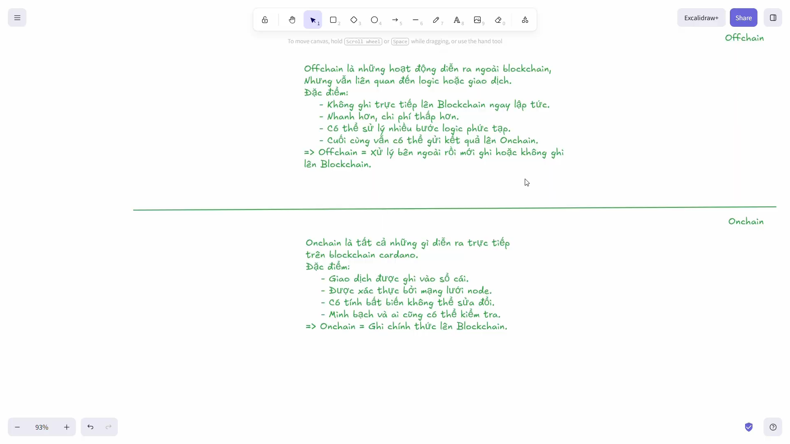
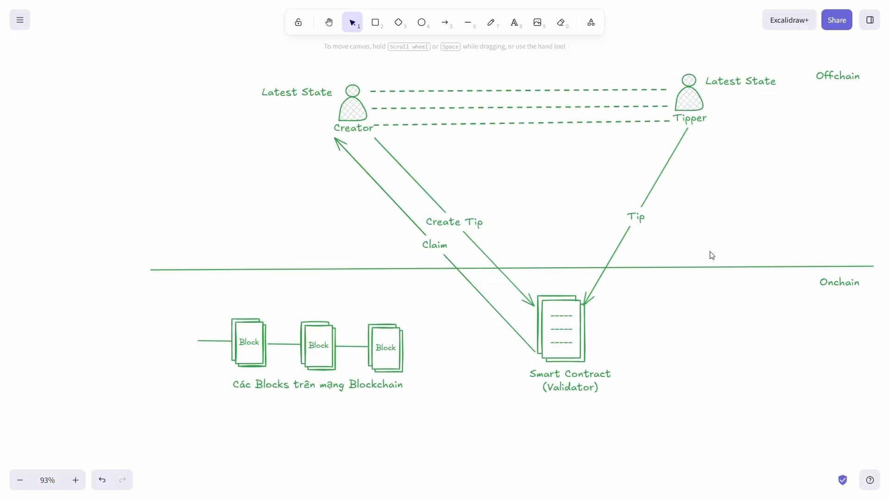
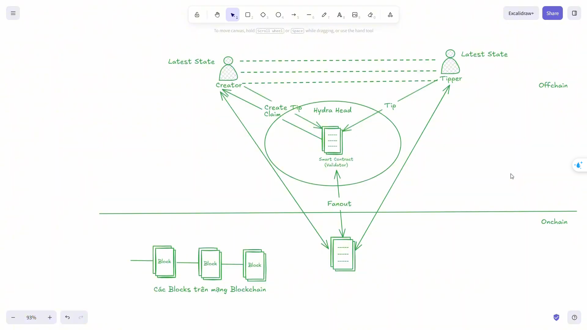
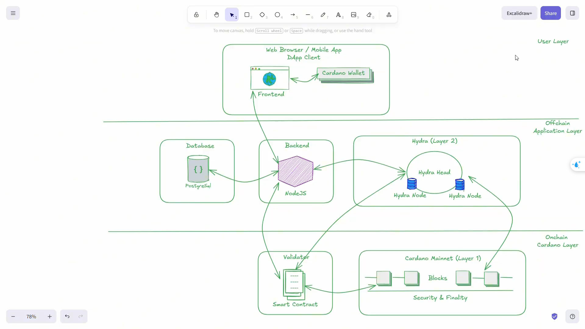

# **Thiết kế kiến ​​trúc và quy trình làm việc của một ứng dụng phi tập trung Hydra**

**Quy trình làm việc được thiết kế để tận dụng tốc độ của Hydra trong xử lý off-chain, đồng thời vẫn đảm bảo tính an toàn khi đồng bộ về blockchain chính.**

---

## Mở đầu

Trong bối cảnh các ứng dụng phi tập trung (DApp) ngày càng phát triển và đòi hỏi khả năng xử lý giao dịch nhanh, chi phí thấp nhưng vẫn đảm bảo tính bảo mật cao, việc tận dụng các giải pháp mở rộng như Hydra trên nền tảng Cardano trở nên đặc biệt quan trọng. Đối với bài toán TipJar – một mô hình đơn giản nhưng mang tính đại diện cho nhiều ứng dụng tài chính vi mô – việc thiết kế hệ thống không chỉ dừng lại ở việc viết smart contract, mà còn cần một kiến trúc tổng thể hợp lý để đảm bảo hiệu năng và khả năng mở rộng.

Phần này tập trung vào việc xây dựng và phân tích kiến trúc của DApp TipJar khi triển khai trên Cardano kết hợp với Hydra. Trước hết, chúng ta sẽ làm rõ cách phân tách hệ thống thành hai lớp chính: On-chain (xử lý logic cốt lõi và đảm bảo tính bảo mật) và Off-chain (xử lý giao dịch, điều phối trạng thái và tương tác với Hydra Head). Việc phân tách này giúp tận dụng tối đa ưu điểm của từng lớp, đồng thời giảm tải cho blockchain chính.

Tiếp theo, nội dung sẽ đi sâu vào thiết kế kiến trúc tổng thể và luồng hoạt động của DApp, từ lúc người dùng tương tác trên giao diện cho đến khi giao dịch được xử lý trong Hydra và đồng bộ lại với mạng chính. Bên cạnh đó, chúng ta cũng phân tích các SDK và công cụ phổ biến trong hệ sinh thái Cardano và Hydra nhằm hỗ trợ việc phát triển một cách hiệu quả và có hệ thống. Cuối cùng, dựa trên các tiêu chí như hiệu năng, độ phức tạp và khả năng mở rộng, phần này sẽ đưa ra định hướng lựa chọn công nghệ phù hợp cho bài toán TipJar.

---

## Mục tiêu

Mục tiêu của phần này là giúp người đọc có được cái nhìn toàn diện về cách thiết kế và triển khai một DApp TipJar trên nền tảng Cardano kết hợp với Hydra, không chỉ ở mức lý thuyết mà còn mang tính thực tiễn cao.

Cụ thể, trước tiên người đọc sẽ hiểu rõ cách tổ chức kiến trúc hệ thống theo mô hình On-chain và Off-chain, cũng như vai trò của từng thành phần trong việc đảm bảo tính đúng đắn và hiệu năng của ứng dụng. Đây là nền tảng quan trọng để tránh việc đưa quá nhiều logic lên blockchain hoặc xử lý sai trách nhiệm giữa các lớp.

Bên cạnh đó, phần này giúp người đọc nắm được luồng hoạt động chi tiết của một DApp khi chạy trong môi trường Hydra, từ việc khởi tạo giao dịch, xử lý trong Hydra Head cho đến khi chốt trạng thái về layer 1. Việc hiểu rõ luồng này là yếu tố then chốt để xây dựng các ứng dụng có khả năng xử lý nhanh và phản hồi gần như theo thời gian thực.

Ngoài ra, người đọc cũng sẽ được làm quen với các SDK và công cụ hỗ trợ phát triển trong hệ sinh thái Cardano, từ việc viết smart contract bằng Aiken hoặc Plutus cho đến xây dựng transaction và tích hợp với Hydra. Từ đó, có thể đánh giá và lựa chọn được stack công nghệ phù hợp với yêu cầu của bài toán.

Cuối cùng, mục tiêu quan trọng là giúp người đọc có đủ nền tảng để tự thiết kế, triển khai và mở rộng một DApp hoàn chỉnh, sẵn sàng áp dụng vào các kịch bản thực tế với yêu cầu cao về hiệu năng, chi phí và trải nghiệm người dùng.

---

## Kiến trúc On-chain và Off-chain trong hệ thống TipJar (Cardano & Hydra).

Trong hệ thống TipJar được xây dựng trên nền tảng Cardano kết hợp với Hydra, việc phân tách kiến trúc thành hai lớp On-chain và Off-chain là yếu tố cốt lõi giúp đạt được cả hai mục tiêu: đảm bảo tính bảo mật và tối ưu hiệu năng. Mỗi lớp đảm nhiệm một vai trò riêng biệt, nhưng đồng thời phải phối hợp chặt chẽ để tạo thành một hệ thống hoàn chỉnh.

### 🔐 1. Kiến trúc On-chain (Smart Contract)

Lớp On-chain trong hệ thống TipJar được triển khai trực tiếp trên blockchain Cardano, đóng vai trò là nền tảng đảm bảo tính bảo mật, minh bạch và tính đúng đắn của toàn bộ ứng dụng. Thành phần cốt lõi của lớp này là smart contract (validator), được viết bằng Aiken (hoặc Plutus), chịu trách nhiệm xác thực các giao dịch liên quan đến TipJar.

Cụ thể, smart contract định nghĩa các quy tắc quan trọng như: một giao dịch tip hợp lệ phải làm tăng giá trị của UTxO tại địa chỉ contract tối thiểu một lượng minimum_tip, và chỉ có chủ sở hữu (owner) mới có quyền thực hiện hành động rút tiền (Claim). Ngoài ra, validator còn kiểm soát cấu trúc của transaction, đảm bảo rằng trạng thái của TipJar luôn được duy trì nhất quán, ví dụ như yêu cầu chỉ tồn tại một UTxO đại diện cho contract tại mọi thời điểm.

Một điểm quan trọng trong thiết kế On-chain là nguyên tắc tối giản logic. Do việc thực thi trên blockchain có chi phí cao và bị giới hạn về tài nguyên (CPU, memory), smart contract chỉ nên thực hiện các kiểm tra cần thiết, tránh xử lý các nghiệp vụ phức tạp. Điều này không chỉ giúp giảm chi phí giao dịch mà còn làm cho contract dễ kiểm thử, dễ audit và an toàn hơn khi triển khai trong môi trường thực tế.

Ngoài ra, trong bối cảnh tích hợp với Hydra, smart contract vẫn giữ vai trò là “nguồn chân lý cuối cùng” (final source of truth). Mặc dù nhiều giao dịch sẽ được xử lý off-chain, nhưng khi cần commit về layer 1, tất cả đều phải vượt qua sự kiểm tra của validator. Điều này đảm bảo rằng không có trạng thái sai lệch nào có thể được ghi nhận lên blockchain.

### ⚙️ 2. Kiến trúc Off-chain (Backend & Hydra)

Lớp Off-chain đóng vai trò xử lý phần lớn logic của ứng dụng, đặc biệt khi hệ thống được tích hợp với Hydra để tối ưu hiệu năng. Thành phần này bao gồm backend (có thể viết bằng Node.js, TypeScript, hoặc các ngôn ngữ khác) và các module tương tác với Hydra Head.

Khi người dùng thực hiện một hành động như gửi tip, frontend sẽ gửi yêu cầu đến backend. Backend sau đó xây dựng transaction dựa trên trạng thái hiện tại của TipJar, bao gồm việc lựa chọn UTxO phù hợp, thiết lập redeemer và đảm bảo transaction tuân thủ logic của smart contract. Thay vì gửi trực tiếp lên blockchain Cardano, transaction này được đưa vào Hydra Head, nơi các participant có thể xác nhận giao dịch gần như ngay lập tức.

Hydra cho phép xử lý giao dịch với độ trễ rất thấp và chi phí gần như bằng không, nhờ vào cơ chế off-chain giữa các node tham gia Head. Backend cũng chịu trách nhiệm quản lý trạng thái tạm thời của TipJar trong Hydra, đảm bảo rằng tất cả các participant đều có cùng một trạng thái nhất quán. Điều này bao gồm việc theo dõi các giao dịch đã được xác nhận, cập nhật số dư và xử lý các sự kiện phát sinh.

Ngoài ra, khi Hydra Head được đóng (close), backend sẽ thực hiện việc tổng hợp trạng thái cuối cùng và chuẩn bị giao dịch commit lên blockchain chính. Đây là bước quan trọng để đảm bảo rằng toàn bộ các thay đổi off-chain được ghi nhận một cách chính thức và an toàn.

### 🔄 3. Sự phối hợp giữa On-chain và Off-chain

Kiến trúc TipJar trên Cardano và Hydra không phải là hai hệ thống tách biệt, mà là một mô hình kết hợp (hybrid) giữa On-chain và Off-chain. Sự phối hợp giữa hai lớp này là yếu tố quyết định đến tính hiệu quả và độ tin cậy của toàn bộ ứng dụng.

Trong quá trình vận hành, các giao dịch được xử lý chủ yếu trong Hydra Head để tận dụng tốc độ và chi phí thấp. Tuy nhiên, mọi transaction được tạo ra ở lớp Off-chain đều phải tuân thủ các quy tắc đã được định nghĩa trong smart contract On-chain. Điều này có nghĩa là backend phải “xây dựng đúng ngay từ đầu”, đảm bảo rằng transaction sẽ hợp lệ nếu được đưa lên blockchain.

Khi Hydra Head đóng lại, trạng thái cuối cùng của TipJar sẽ được commit lên Cardano. Tại thời điểm này, smart contract sẽ thực hiện việc xác minh lần cuối, đảm bảo rằng toàn bộ chuỗi giao dịch đã diễn ra hợp lệ. Nếu có bất kỳ sai lệch nào, transaction sẽ bị từ chối, từ đó bảo vệ hệ thống khỏi các trạng thái không hợp lệ.

Sự phối hợp này giúp đạt được sự cân bằng giữa hiệu năng và bảo mật: Off-chain xử lý nhanh, On-chain đảm bảo đúng.

### 🚀 4. Lợi ích của mô hình kiến trúc

Việc phân tách hệ thống thành hai lớp On-chain và Off-chain mang lại nhiều lợi ích đáng kể cho ứng dụng TipJar. Trước hết, nó giúp giảm tải cho blockchain chính, vì phần lớn giao dịch được xử lý trong Hydra thay vì gửi trực tiếp lên layer 1. Điều này không chỉ giảm chi phí mà còn cải thiện đáng kể tốc độ phản hồi.

Thứ hai, kiến trúc này giúp nâng cao trải nghiệm người dùng. Thay vì phải chờ xác nhận từ blockchain với độ trễ cao, người dùng có thể thấy kết quả giao dịch gần như ngay lập tức khi sử dụng Hydra. Điều này đặc biệt quan trọng đối với các ứng dụng có tần suất giao dịch cao như TipJar.

Thứ ba, việc giữ logic quan trọng trên On-chain giúp đảm bảo tính an toàn và khả năng kiểm chứng của hệ thống. Ngay cả khi phần Off-chain gặp sự cố, trạng thái cuối cùng vẫn có thể được xác minh và bảo vệ bởi smart contract trên Cardano.

Cuối cùng, mô hình này mang lại khả năng mở rộng tốt hơn. Khi số lượng người dùng tăng lên, hệ thống vẫn có thể xử lý hiệu quả nhờ vào Hydra, trong khi vẫn giữ được độ tin cậy của blockchain. Đây là một hướng tiếp cận phù hợp cho các DApp hiện đại, nơi hiệu năng và bảo mật đều là những yếu tố không thể thiếu.

## Thiết kế kiến trúc và luồng hoạt động của DApp TipJar trên Hydra

Hệ thống TipJar được thiết kế theo mô hình phân lớp rõ ràng, bao gồm ba tầng chính: User Layer, Off-chain Application Layer và On-chain Cardano Layer. Kiến trúc này cho phép tách biệt giữa phần tương tác người dùng, xử lý logic ứng dụng và đảm bảo bảo mật trên blockchain, đồng thời tận dụng sức mạnh của Hydra để tối ưu hiệu năng.

### 👤 1. User Layer (Frontend & Wallet)

Tầng User Layer là lớp cao nhất trong kiến trúc hệ thống, đóng vai trò là cầu nối trực tiếp giữa người dùng và toàn bộ DApp TipJar. Đây là nơi quyết định trải nghiệm người dùng (UX/UI), đồng thời cũng là điểm khởi đầu của mọi luồng giao dịch trong hệ thống. Người dùng có thể truy cập ứng dụng thông qua trình duyệt web hoặc ứng dụng di động, tương tác với hệ thống một cách trực quan mà không cần hiểu sâu về blockchain hay Hydra.

Thành phần chính của tầng này bao gồm Frontend (DApp Client) và Cardano Wallet. Frontend được xây dựng bằng các framework hiện đại như React, Next.js hoặc tương tự, chịu trách nhiệm hiển thị giao diện và xử lý các tương tác của người dùng. Thông qua frontend, người dùng có thể thực hiện các hành động như gửi tip, xem tổng số tiền trong TipJar, theo dõi lịch sử giao dịch hoặc thực hiện rút tiền (nếu là owner). Ngoài ra, frontend còn đảm nhiệm việc hiển thị trạng thái giao dịch theo thời gian thực, đặc biệt khi tích hợp với Hydra, giúp người dùng cảm nhận được tốc độ xử lý gần như tức thì.

Song song với frontend là Cardano Wallet, đóng vai trò cực kỳ quan trọng trong việc đảm bảo tính bảo mật và xác thực. Các ví như Nami, Eternl hay Lace không chỉ lưu trữ tài sản của người dùng mà còn cung cấp khả năng ký giao dịch bằng private key. Khi một hành động yêu cầu tương tác với blockchain (ví dụ: gửi tip hoặc rút tiền), frontend sẽ gửi yêu cầu đến ví để người dùng xác nhận và ký transaction. Điều này đảm bảo rằng mọi giao dịch đều được thực hiện bởi chính chủ sở hữu tài khoản và không thể bị giả mạo.

Quy trình tương tác tại tầng này thường diễn ra theo các bước rõ ràng. Khi người dùng thực hiện một hành động trên giao diện (ví dụ: nhập số tiền và nhấn “Tip”), frontend sẽ chuẩn bị dữ liệu cần thiết và yêu cầu ví ký giao dịch. Sau khi người dùng xác nhận trong ví, transaction đã được ký sẽ được gửi xuống backend để tiếp tục xử lý trong Hydra hoặc trên blockchain. Cơ chế này tạo ra một luồng xử lý an toàn, trong đó frontend không bao giờ trực tiếp nắm giữ private key, mà mọi thao tác nhạy cảm đều được thực hiện thông qua ví.

Ngoài ra, User Layer còn có vai trò đảm bảo tính thân thiện và dễ sử dụng của hệ thống. Một thiết kế tốt sẽ giúp người dùng không cần quan tâm đến các khái niệm phức tạp như UTxO, validator hay Hydra Head, mà chỉ cần tập trung vào hành động đơn giản như “gửi tip” hoặc “rút tiền”. Điều này đặc biệt quan trọng trong việc đưa các ứng dụng blockchain đến gần hơn với người dùng phổ thông.

Tóm lại, User Layer không chỉ là giao diện hiển thị, mà còn là lớp chịu trách nhiệm tương tác, xác thực và khởi tạo giao dịch. Nó đóng vai trò quan trọng trong việc kết nối người dùng với hệ thống TipJar, đảm bảo mọi hành động đều an toàn, minh bạch và dễ sử dụng.

### ⚙️ 2. Off-chain Application Layer

Tầng Off-chain Application Layer là trung tâm xử lý chính của toàn bộ hệ thống TipJar, nơi diễn ra phần lớn các logic nghiệp vụ và tối ưu hiệu năng thông qua việc tận dụng Hydra. Khác với lớp On-chain chỉ đảm nhiệm vai trò xác thực và bảo mật, tầng Off-chain chịu trách nhiệm điều phối luồng dữ liệu, xây dựng giao dịch và đảm bảo hệ thống vận hành trơn tru trong thời gian thực.

Kiến trúc của tầng này bao gồm ba thành phần chính: Backend (Node.js), Database (PostgreSQL) và Hydra Layer (Layer 2). Ba thành phần này phối hợp chặt chẽ với nhau để xử lý yêu cầu từ người dùng, duy trì trạng thái hệ thống và đảm bảo tính nhất quán dữ liệu.

#### 🔹 Backend (Node.js)

Backend đóng vai trò là “bộ não” của hệ thống, chịu trách nhiệm điều phối toàn bộ luồng hoạt động giữa frontend, Hydra và blockchain. Khi nhận được yêu cầu từ frontend (ví dụ: gửi tip), backend sẽ thực hiện nhiều bước xử lý như kiểm tra dữ liệu đầu vào, truy vấn trạng thái hiện tại của TipJar, và xây dựng transaction phù hợp với logic của smart contract.

Một nhiệm vụ quan trọng của backend là đảm bảo rằng mọi transaction được tạo ra đều hợp lệ theo validator. Điều này có nghĩa là backend phải “hiểu” logic on-chain để xây dựng transaction đúng ngay từ đầu, tránh việc bị từ chối khi đưa lên blockchain hoặc khi commit từ Hydra về layer 1.

Ngoài ra, backend còn đảm nhiệm nhiều chức năng quan trọng khác:

- Quản lý trạng thái tạm thời của TipJar trong môi trường Hydra
- Đồng bộ dữ liệu giữa các participant trong Hydra Head
- Lắng nghe và xử lý các sự kiện (event-driven), ví dụ như giao dịch mới, thay đổi trạng thái
- Gửi phản hồi về frontend để cập nhật giao diện theo thời gian thực

Nhờ backend, hệ thống có thể xử lý các logic phức tạp mà không cần đưa lên on-chain, từ đó giảm chi phí và tăng hiệu năng tổng thể.

#### 🔹 Database (PostgreSQL)

Database là thành phần hỗ trợ lưu trữ dữ liệu ngoài chuỗi (off-chain), giúp cải thiện trải nghiệm người dùng và tăng khả năng truy vấn của hệ thống. Trong TipJar, database không đóng vai trò quyết định tính hợp lệ của giao dịch, nhưng lại rất quan trọng trong việc hiển thị và quản lý dữ liệu.

Các loại dữ liệu thường được lưu trữ bao gồm:

- Lịch sử các giao dịch tip (ai gửi, gửi bao nhiêu, thời gian)
- Thông tin người dùng hoặc địa chỉ ví
- Nội dung message hoặc metadata đi kèm mỗi lần tip
- Trạng thái tạm thời của TipJar trong quá trình hoạt động

Việc sử dụng database giúp frontend có thể truy vấn dữ liệu nhanh chóng mà không cần đọc trực tiếp từ blockchain, vốn có độ trễ cao và khó xử lý. Đồng thời, nó cũng hỗ trợ các tính năng nâng cao như thống kê, tìm kiếm hoặc hiển thị lịch sử giao dịch một cách trực quan.

#### 🔹 Hydra Layer (Layer 2)

Hydra là thành phần cốt lõi giúp hệ thống đạt được hiệu năng cao, đóng vai trò như một lớp mở rộng (Layer 2) của Cardano. Trong kiến trúc này, nhiều Hydra Node sẽ cùng tham gia để tạo thành một Hydra Head, nơi các giao dịch được xử lý off-chain giữa các participant.

Khi backend gửi transaction vào Hydra Head, các participant sẽ cùng xác nhận giao dịch theo cơ chế đồng thuận nhẹ, cho phép:

- Xác nhận giao dịch gần như ngay lập tức (near real-time)
- Cập nhật trạng thái TipJar nhanh chóng
- Không cần chờ block confirmation từ Cardano

Điều này giúp giảm đáng kể độ trễ và chi phí so với việc xử lý trực tiếp trên blockchain layer 1. Đặc biệt, với các ứng dụng như TipJar – nơi có thể xảy ra nhiều giao dịch nhỏ liên tục – Hydra mang lại lợi thế rất lớn về hiệu năng.

Tuy nhiên, Hydra không thay thế hoàn toàn blockchain chính. Khi cần đảm bảo tính cuối cùng (finality), Hydra Head sẽ được đóng lại và trạng thái cuối cùng sẽ được commit lên Cardano. Lúc này, smart contract on-chain sẽ thực hiện xác minh lần cuối để đảm bảo tính hợp lệ.

### 🔐 3. On-chain Cardano Layer

Tầng On-chain là lớp nền tảng thấp nhất trong hệ thống, được xây dựng trên blockchain Cardano. Đây là nơi đảm bảo các thuộc tính cốt lõi như bảo mật (security), minh bạch (transparency) và tính xác thực cuối cùng (finality) của toàn bộ hệ thống.

#### 🔹 Smart Contract (Validator)

Validator là thành phần trung tâm của lớp On-chain, đóng vai trò như cơ chế kiểm soát và xác thực toàn bộ giao dịch. Mọi transaction khi được gửi lên blockchain đều phải thỏa mãn các điều kiện được định nghĩa trong smart contract.

Cụ thể, validator sẽ kiểm tra:

- Giao dịch tip phải làm tăng giá trị UTxO theo đúng logic hệ thống
- Chỉ chủ sở hữu hợp lệ (owner) mới có quyền rút hoặc sử dụng số tiền
- Cấu trúc transaction phải tuân thủ đúng thiết kế và quy tắc đã được định nghĩa

Có thể xem smart contract như một “người gác cổng” của hệ thống, đảm bảo rằng chỉ những giao dịch hợp lệ mới được phép đi vào blockchain, loại bỏ hoàn toàn các hành vi sai lệch hoặc gian lận.

#### 🔹 Cardano Mainnet (Layer 1)

Cardano Mainnet là lớp blockchain chính (Layer 1), nơi lưu trữ trạng thái cuối cùng và có tính bất biến của toàn bộ hệ thống.

Khi một Hydra Head được đóng lại, toàn bộ trạng thái tổng hợp cuối cùng sẽ được ghi nhận (commit) lên Layer 1.

Tại thời điểm này:

- Smart contract thực hiện bước xác minh cuối cùng đối với trạng thái giao dịch
- Dữ liệu hợp lệ được ghi vào block trên blockchain
- Trạng thái trở nên immutable và có thể kiểm chứng công khai

Nhờ cơ chế này, Layer 1 của Cardano đảm bảo mức độ an toàn tuyệt đối và tính finality cao, đóng vai trò là nền tảng tin cậy cho toàn bộ kiến trúc hệ thống.

### 🔄 4. Luồng hoạt động tổng thể

Dựa trên kiến trúc hệ thống đã xây dựng, luồng hoạt động tổng thể được thiết kế theo hướng phân tách rõ ràng giữa các lớp xử lý, bao gồm frontend, backend, Hydra Layer và Cardano Layer 1. Mục tiêu của luồng này là đảm bảo trải nghiệm người dùng nhanh, gần như thời gian thực, đồng thời vẫn duy trì tính bảo mật và tính xác thực của blockchain.

Toàn bộ quá trình vận hành có thể được mô tả theo các bước tuần tự như sau:

#### 1. Người dùng khởi tạo giao dịch trên Frontend

Quy trình bắt đầu khi người dùng thực hiện một hành động trên giao diện frontend, ví dụ như gửi tip cho một người dùng khác trong hệ thống.

Tại bước này:

- Người dùng nhập thông tin giao dịch (người nhận, số lượng tip, và các dữ liệu liên quan)
- Frontend thực hiện kiểm tra dữ liệu cơ bản nhằm đảm bảo tính hợp lệ ban đầu
- Payload giao dịch được tạo ra để chuẩn bị gửi đi xử lý

Frontend đóng vai trò là lớp tương tác trực tiếp, giúp người dùng thao tác với hệ thống một cách trực quan và dễ hiểu.

#### 2. Ký giao dịch bằng ví Cardano

Sau khi thông tin giao dịch được chuẩn bị, ví Cardano của người dùng sẽ tiến hành ký transaction.

Bước này có vai trò cực kỳ quan trọng trong việc đảm bảo tính an toàn của hệ thống:

- Xác thực người dùng là chủ sở hữu hợp lệ của tài sản (UTxO)
- Đảm bảo giao dịch không bị thay đổi sau khi được ký
- Tạo chữ ký số (digital signature) để xác minh tính toàn vẹn của transaction

Nhờ cơ chế này, mọi giao dịch đều mang tính không thể giả mạo (non-repudiation).

#### 3. Gửi yêu cầu đến Backend (Off-chain Processing)

Sau khi transaction đã được ký, frontend gửi yêu cầu đến backend để xử lý logic hệ thống.

Backend thực hiện các nhiệm vụ chính:

- Nhận dữ liệu giao dịch từ frontend
- Kiểm tra và xác thực logic nghiệp vụ ban đầu
- Ánh xạ giao dịch với smart contract tương ứng
- Xây dựng transaction theo đúng định dạng của Cardano và Hydra
- Kiểm tra các điều kiện như số dư, quyền truy cập và trạng thái hệ thống

Backend đóng vai trò là lớp trung gian quan trọng, đảm bảo mọi giao dịch đều hợp lệ trước khi được đưa vào môi trường xử lý tốc độ cao.

#### 4. Xử lý giao dịch trong Hydra Head

Sau khi transaction được backend xử lý và chuẩn bị hoàn chỉnh, nó sẽ được gửi vào Hydra Head.

Tại đây, Hydra đóng vai trò là Layer 2 scaling solution, giúp xử lý giao dịch với tốc độ gần như tức thì.

Trong quá trình này:

- Giao dịch được xử lý trong môi trường off-chain giữa các participant
- Không cần chờ xác nhận block như trên Layer 1
- Trạng thái hệ thống được cập nhật ngay lập tức sau mỗi giao dịch hợp lệ
- Tất cả participant trong Hydra Head đều có thể đồng bộ trạng thái

Điều này giúp hệ thống đạt được hiệu năng cao, giảm thiểu độ trễ đáng kể so với việc xử lý trực tiếp trên blockchain.

#### 5. Cập nhật trạng thái và phản hồi về Frontend

Ngay sau khi Hydra xử lý giao dịch, trạng thái mới của hệ thống sẽ được cập nhật và gửi ngược lại backend, sau đó phản hồi về frontend.

Frontend sẽ:

- Cập nhật giao diện theo trạng thái mới nhất
- Hiển thị kết quả giao dịch cho người dùng theo thời gian thực
- Đồng bộ số dư hoặc dữ liệu liên quan
- Thông báo trạng thái thành công hoặc thất bại (nếu có)

Nhờ cơ chế này, người dùng có trải nghiệm gần giống ứng dụng Web2 nhưng vẫn đảm bảo tính phi tập trung của Web3.

#### 6. Commit trạng thái cuối cùng lên Cardano Layer 1

Trong trường hợp cần thiết, ví dụ khi kết thúc một Hydra Head hoặc đồng bộ trạng thái toàn cục, hệ thống sẽ thực hiện việc commit dữ liệu lên Cardano Mainnet.

Quá trình này bao gồm:

- Tổng hợp toàn bộ trạng thái cuối cùng từ Hydra Head
- Smart contract thực hiện kiểm tra và xác thực lần cuối
- Dữ liệu hợp lệ được ghi vào blockchain Cardano
- Trạng thái trở thành bất biến (immutable) và có thể kiểm chứng công khai

Đây là bước đảm bảo tính finality tuyệt đối, giúp hệ thống đạt được mức độ tin cậy cao nhất.

### 🚀 5. Tổng kết kiến trúc

Kiến trúc hệ thống được thiết kế theo hướng kết hợp hài hòa giữa hai lớp xử lý chính là On-chain (Cardano Layer 1) và Off-chain (Hydra Layer + Backend). Sự phân tách này không chỉ giúp tối ưu hiệu năng mà còn đảm bảo các đặc tính cốt lõi của một hệ thống blockchain như tính bảo mật, minh bạch và khả năng mở rộng.

Ở góc nhìn tổng thể, có thể thấy kiến trúc được xây dựng theo mô hình ba lớp chính:

#### 🔹 On-chain Layer (Cardano)

Lớp On-chain đóng vai trò là nền tảng tin cậy của toàn bộ hệ thống. Đây là nơi đảm bảo:

- Tính đúng đắn (correctness) của giao dịch thông qua smart contract (validator)
- Tính bảo mật (security) nhờ cơ chế đồng thuận của Cardano
- Tính bất biến (immutability) khi dữ liệu đã được ghi vào blockchain

Mọi trạng thái quan trọng cuối cùng của hệ thống đều được xác thực và lưu trữ tại đây, đảm bảo khả năng kiểm chứng công khai và không thể chỉnh sửa.

#### 🔹 Off-chain Layer (Hydra)

Lớp Off-chain được xây dựng dựa trên Hydra, đóng vai trò là tầng xử lý hiệu năng cao.

Lớp này giúp:

- Xử lý giao dịch gần như tức thì (low-latency execution)
- Giảm tải cho blockchain chính bằng cách xử lý ngoài chuỗi
- Tối ưu chi phí giao dịch (gas/fee reduction)
- Cung cấp trải nghiệm thời gian thực cho người dùng

Hydra hoạt động như một môi trường mở rộng (scaling layer), cho phép nhiều giao dịch được xử lý song song mà không cần ghi ngay lên blockchain.

#### 🔹 Backend Layer (Orchestration Layer)

Backend đóng vai trò là lớp trung gian điều phối toàn bộ hệ thống, kết nối giữa frontend, Hydra và Cardano.

Cụ thể, backend đảm nhiệm:

- Xử lý logic nghiệp vụ của ứng dụng
- Xây dựng và định dạng transaction theo chuẩn Cardano/Hydra
- Điều phối luồng dữ liệu giữa Off-chain và On-chain
- Đảm bảo tính nhất quán của trạng thái hệ thống

Có thể xem backend như “cầu nối kỹ thuật” giúp hai thế giới On-chain và Off-chain hoạt động đồng bộ và trơn tru với nhau.

## Phân tích các SDK hỗ trợ phát triển TipJar trên Cardano và Hydra

Để xây dựng một ứng dụng TipJar hoàn chỉnh trên Cardano kết hợp Hydra, hệ thống cần sử dụng một tập hợp các SDK và toolchain khác nhau. Mỗi SDK đóng vai trò riêng trong từng lớp kiến trúc, từ on-chain smart contract, off-chain logic cho đến layer mở rộng hiệu năng Hydra.

Có thể phân loại các SDK chính thành ba nhóm: On-chain SDK, Off-chain SDK và Hydra SDK.

### 🔐 1. SDK cho On-chain (Smart Contract Layer)

Aiken là một trong những công cụ quan trọng và hiện đại nhất trong hệ sinh thái phát triển smart contract trên Cardano. Đây là một ngôn ngữ và toolchain được thiết kế chuyên biệt cho việc xây dựng validator (on-chain logic), giúp đơn giản hóa quá trình phát triển nhưng vẫn đảm bảo tính an toàn và độ chính xác cao khi triển khai trên blockchain.

Về mặt đặc điểm kỹ thuật, Aiken được xây dựng theo phong cách functional programming với cú pháp hiện đại, dễ đọc và dễ tiếp cận, mang nhiều điểm tương đồng với Rust hoặc Elm. Điều này giúp lập trình viên dễ dàng xây dựng các logic phức tạp nhưng vẫn giữ được tính rõ ràng, hạn chế lỗi trong quá trình phát triển.

Một số đặc điểm nổi bật của Aiken:

- Ngôn ngữ functional, cú pháp hiện đại, dễ tiếp cận
- Biên dịch trực tiếp sang Plutus Core (UPLC) để chạy on-chain
- Hỗ trợ strong typing và type inference giúp giảm lỗi logic ngay từ compile-time
- Tích hợp testing framework giúp kiểm thử smart contract trước khi deploy

Nhờ những đặc điểm này, Aiken giúp quá trình phát triển smart contract trở nên an toàn và có cấu trúc hơn, đặc biệt phù hợp với các hệ thống yêu cầu tính đúng đắn cao như TipJar.

Trong hệ thống TipJar, Aiken được sử dụng để xây dựng các validator on-chain nhằm kiểm soát toàn bộ logic giao dịch. Cụ thể, smart contract sẽ đảm nhận việc kiểm tra các điều kiện quan trọng như giao dịch tip có hợp lệ hay không, quyền sở hữu UTxO của người thực hiện giao dịch, cũng như logic rút tiền (withdraw rules) có tuân thủ đúng thiết kế hệ thống hay không.

Nhờ đó, toàn bộ business logic quan trọng nhất được đưa lên blockchain và không thể bị thay đổi sau khi triển khai. Có thể xem Aiken như một lớp “luật bất biến” của hệ thống, đảm bảo mọi giao dịch đều tuân thủ đúng quy tắc đã định nghĩa trước đó, đồng thời tăng cường tính minh bạch và độ tin cậy của toàn bộ ứng dụng TipJar.

### 🔄 2. SDK cho Off-chain (Application Layer)

Off-chain SDK đóng vai trò quan trọng trong việc xây dựng toàn bộ logic ứng dụng phía ngoài blockchain, bao gồm việc tạo và ký transaction, quản lý ví người dùng, cũng như giao tiếp với mạng Cardano. Đây là lớp trung gian giúp đơn giản hóa việc tương tác với blockchain, vốn thường khá phức tạp ở mức low-level.

#### 🔹 Lucid (TypeScript SDK cho Cardano)

Lucid là một trong những SDK phổ biến và mạnh mẽ nhất hiện nay trong hệ sinh thái Cardano, đặc biệt dành cho phát triển off-chain bằng TypeScript. SDK này cung cấp một abstraction layer giúp lập trình viên dễ dàng làm việc với transaction và UTxO mà không cần xử lý trực tiếp các chi tiết phức tạp của blockchain.

Các chức năng chính của Lucid:

- Tạo và ký transaction bằng TypeScript
- Quản lý UTxO một cách trực quan và hiệu quả
- Tích hợp dễ dàng với các wallet browser như Nami, Eternl, Lace
- Tương tác trực tiếp với smart contract (output từ Aiken hoặc Plutus)

Nhờ các tính năng này, Lucid trở thành công cụ quan trọng trong việc xây dựng các ứng dụng DApp trên Cardano, đặc biệt ở lớp off-chain nơi cần xử lý nhiều logic linh hoạt và tương tác với người dùng.

Trong hệ thống TipJar, Lucid được ứng dụng để xử lý các luồng giao dịch chính giữa người dùng và blockchain. Cụ thể, nó được sử dụng để xây dựng transaction gửi tip, truy vấn UTxO của từng người dùng nhằm xác định trạng thái tài sản, cũng như ký các giao dịch trực tiếp từ frontend hoặc backend tùy theo kiến trúc hệ thống.

Nhờ Lucid, việc tương tác với Cardano trở nên đơn giản và dễ tiếp cận hơn rất nhiều, thay vì phải làm việc trực tiếp với các cơ chế low-level serialization phức tạp của blockchain. Có thể xem Lucid là lớp “kết nối trung gian” giúp chuyển đổi logic ứng dụng thành các giao dịch blockchain một cách hiệu quả và an toàn.

#### 🔹 Mesh SDK (Web3 Development Framework)

Mesh SDK là một framework phát triển Web3 được thiết kế theo hướng abstraction cao hơn so với Lucid, nhằm đơn giản hóa tối đa quá trình xây dựng ứng dụng phi tập trung trên Cardano. Thay vì tập trung vào các chi tiết kỹ thuật ở mức transaction và UTxO, Mesh hướng đến việc cung cấp các công cụ ở tầng cao hơn, giúp lập trình viên có thể phát triển nhanh các ứng dụng Web3 với trải nghiệm gần giống Web2.

Các tính năng chính của Mesh SDK:

- Cung cấp React hooks để tích hợp ví (wallet integration) dễ dàng trong frontend
- Hỗ trợ high-level API giúp xây dựng và gửi transaction nhanh chóng
- Tích hợp sẵn các utilities cho NFT, staking và smart contract interaction
- Tối ưu cho phát triển UI/UX trong các ứng dụng Web3 hiện đại

Nhờ cách tiếp cận này, Mesh giúp giảm đáng kể độ phức tạp khi làm việc với blockchain, đặc biệt phù hợp với các dự án ưu tiên trải nghiệm người dùng và tốc độ phát triển giao diện.

Trong hệ thống TipJar, Mesh SDK được sử dụng chủ yếu ở lớp frontend nhằm tối ưu hóa trải nghiệm người dùng. Cụ thể, nó hỗ trợ việc xây dựng giao diện kết nối ví một cách nhanh chóng, cho phép người dùng dễ dàng thực hiện các thao tác như connect wallet, gửi tip transaction trực tiếp từ giao diện, cũng như quản lý trạng thái ví trong suốt phiên làm việc.

Nhờ Mesh, phần frontend của TipJar trở nên nhẹ hơn và ít phụ thuộc vào logic blockchain phức tạp, giúp tập trung nhiều hơn vào trải nghiệm người dùng thay vì xử lý chi tiết kỹ thuật on-chain và off-chain.

Có thể xem Mesh SDK là một lớp “UI-first Web3 framework”, rất phù hợp trong các hệ thống như TipJar, nơi yêu cầu sự đơn giản, nhanh chóng và thân thiện với người dùng cuối.

### ⚡ 3. SDK cho Hydra Layer (Scaling Layer 2)

Hydra đóng vai trò là thành phần mở rộng quan trọng trong kiến trúc hệ thống TipJar, giúp giải quyết bài toán về hiệu năng bằng cách xử lý giao dịch ngoài chuỗi (off-chain) với độ trễ gần như bằng 0. Thay vì phải ghi từng giao dịch lên Cardano Layer 1, Hydra cho phép xử lý nhiều giao dịch trong một môi trường riêng biệt (Hydra Head), từ đó tối ưu hóa tốc độ và khả năng mở rộng của hệ thống.

#### 🔹 Hydra SDK

Hydra SDK cung cấp một bộ công cụ toàn diện để làm việc với Hydra Head, giúp lập trình viên có thể dễ dàng quản lý, vận hành và tương tác với môi trường Layer 2 này mà không cần xử lý quá nhiều logic phức tạp ở mức thấp.

Các chức năng chính của Hydra SDK:

- Quản lý vòng đời Hydra Head (init, open, close)
- Gửi và nhận transaction trong môi trường Hydra
- Đồng bộ state giữa các participant trong cùng một Hydra Head
- Hỗ trợ WebSocket để giao tiếp real-time giữa các node
- Transaction builder tích hợp UTxO và Plutus script

Những chức năng này giúp Hydra trở thành một lớp mở rộng mạnh mẽ, cho phép xử lý giao dịch với tốc độ rất cao trong một môi trường có tính đồng bộ giữa các bên tham gia.

Trong hệ thống TipJar, Hydra SDK được sử dụng như một lớp tăng tốc xử lý giao dịch. Khi người dùng gửi tip, giao dịch không cần phải đi trực tiếp lên blockchain chính mà được xử lý ngay trong Hydra Head, giúp phản hồi gần như tức thì. Điều này mang lại trải nghiệm người dùng mượt mà, gần giống các hệ thống Web2 nhưng vẫn giữ được bản chất phi tập trung của Web3.

Ngoài ra, Hydra còn giúp giảm đáng kể chi phí giao dịch, khi các thao tác diễn ra trong Hydra Head gần như không phát sinh fee như trên Layer 1. Đồng thời, trạng thái giữa các người dùng được cập nhật liên tục theo thời gian thực, đảm bảo tính nhất quán trong toàn bộ hệ thống.

Có thể xem Hydra SDK là lớp “real-time execution layer”, giúp TipJar đạt được khả năng xử lý giao dịch với high throughput và low latency, đặc biệt phù hợp với các use case micro-payment như tipping, nơi tốc độ và trải nghiệm người dùng đóng vai trò quan trọng.

#### 🔹 Mesh SDK (Hỗ trợ tích hợp Hydra ở Frontend Layer)

Bên cạnh Hydra SDK ở tầng core xử lý Layer 2, Mesh SDK đóng vai trò là một lớp hỗ trợ quan trọng trong việc kết nối Hydra với trải nghiệm người dùng ở frontend. Nếu Hydra tập trung vào xử lý giao dịch và đồng bộ state ở mức hệ thống, thì Mesh giúp đơn giản hóa cách mà frontend tương tác với các luồng dữ liệu và transaction này, từ đó tạo ra trải nghiệm người dùng liền mạch hơn.

Các chức năng chính liên quan của Mesh SDK:

- Cung cấp React hooks để kết nối ví và quản lý trạng thái người dùng
- Hỗ trợ high-level API giúp trigger transaction một cách đơn giản
- Cung cấp lớp abstraction để tích hợp logic off-chain và Layer 2
- Đồng bộ UI state với backend và Hydra theo thời gian thực (realtime)

Nhờ những tính năng này, Mesh SDK giúp giảm đáng kể độ phức tạp khi xây dựng frontend cho các ứng dụng Web3. Thay vì phải làm việc trực tiếp với các luồng transaction phức tạp từ Hydra hoặc xử lý UTxO ở mức thấp, lập trình viên có thể sử dụng các API ở tầng cao hơn để thao tác với blockchain một cách trực quan hơn.

Trong hệ thống TipJar, Mesh SDK được sử dụng như một lớp trung gian giữa frontend và backend/Hydra, giúp việc tích hợp trở nên đơn giản và nhất quán hơn. Các thao tác như kết nối ví, gửi tip transaction hoặc cập nhật trạng thái giao dịch đều được Mesh hỗ trợ thông qua các API và hooks sẵn có, từ đó giảm đáng kể khối lượng logic cần xử lý ở phía frontend.

Điều này giúp trải nghiệm người dùng trở nên mượt mà hơn, đồng thời vẫn đảm bảo hệ thống có thể tận dụng được sức mạnh xử lý real-time của Hydra ở tầng backend. Có thể xem Mesh SDK là lớp “experience layer” giúp chuyển đổi các tương tác blockchain phức tạp thành các thao tác đơn giản, thân thiện với người dùng cuối.

### 🧠 4. SDK hỗ trợ hạ tầng & tích hợp (Supporting Tools)

Bên cạnh các SDK chính phục vụ cho việc phát triển smart contract, off-chain logic và Layer 2, hệ thống TipJar còn cần một lớp công cụ hạ tầng (supporting tools) để đảm bảo khả năng vận hành ổn định, truy vấn dữ liệu hiệu quả và tích hợp với mạng Cardano một cách linh hoạt. Các công cụ này đóng vai trò như lớp trung gian giữa ứng dụng và blockchain node, giúp giảm đáng kể độ phức tạp khi làm việc trực tiếp với Cardano infrastructure.

Các tool hỗ trợ chính trong hệ thống:

- Ogmios → giao tiếp realtime với Cardano node thông qua WebSocket/JSON-RPC
- Kupo → indexing UTxO, hỗ trợ truy vấn dữ liệu nhanh và có cấu trúc
- Blockfrost → API layer đơn giản hóa việc truy vấn blockchain mà không cần tự vận hành node

Các công cụ này không trực tiếp tham gia vào logic nghiệp vụ của ứng dụng, nhưng lại đóng vai trò cực kỳ quan trọng trong việc đảm bảo hệ thống có thể truy xuất dữ liệu blockchain một cách nhanh chóng, chính xác và ổn định.

Về mặt kiến trúc, Ogmios giúp backend có khả năng giao tiếp realtime với Cardano node, từ đó theo dõi trạng thái blockchain theo thời gian thực mà không cần polling thủ công. Trong khi đó, Kupo đóng vai trò như một indexing layer, giúp tổ chức và truy vấn UTxO một cách hiệu quả hơn, đặc biệt hữu ích trong các hệ thống có nhiều giao dịch như TipJar. Blockfrost lại cung cấp một API abstraction đơn giản, giúp giảm đáng kể công sức vận hành node và phù hợp cho các môi trường phát triển nhanh hoặc prototype.

Nhờ sự kết hợp của các công cụ này, hệ thống đạt được khả năng truy vấn dữ liệu blockchain nhanh hơn, giảm độ phức tạp trong việc tự vận hành full node Cardano, đồng thời tăng khả năng mở rộng của backend khi xử lý nhiều request đồng thời. Có thể xem đây là lớp “infrastructure abstraction layer”, giúp hệ thống tập trung vào logic ứng dụng thay vì phải xử lý trực tiếp các vấn đề hạ tầng phức tạp của blockchain.

### 🔗 5. Tổng kết vai trò SDK trong TipJar

Trong kiến trúc tổng thể của hệ thống TipJar, các SDK và công cụ hỗ trợ không hoạt động độc lập mà được thiết kế để bổ trợ lẫn nhau theo từng lớp trong hệ thống. Mỗi nhóm công cụ đảm nhận một vai trò riêng biệt, từ việc đảm bảo logic on-chain, xử lý giao dịch off-chain, tăng tốc Layer 2 cho đến hỗ trợ hạ tầng dữ liệu. Sự kết hợp này tạo nên một pipeline phát triển hoàn chỉnh, giúp hệ thống vừa đảm bảo tính bảo mật của blockchain, vừa đạt được hiệu năng cao và khả năng mở rộng tốt.

Có thể tổng hợp vai trò các SDK như sau:

- Aiken → đảm bảo logic on-chain an toàn, chính xác và bất biến trên Cardano
- Lucid / Mesh → hỗ trợ xây dựng, quản lý và ký transaction ở lớp off-chain
- Hydra SDK → xử lý giao dịch tốc độ cao trong Layer 2 với khả năng real-time
- Ogmios / Kupo / Blockfrost → cung cấp lớp hạ tầng dữ liệu và API hỗ trợ truy vấn blockchain

Nhìn tổng thể, mỗi nhóm công cụ đều đảm nhận một vai trò rõ ràng trong kiến trúc đa lớp của hệ thống. Aiken đóng vai trò “luật bất biến” ở on-chain layer, đảm bảo tính đúng đắn của mọi giao dịch. Lucid và Mesh giúp đơn giản hóa việc xây dựng và ký transaction ở off-chain layer, từ đó kết nối người dùng với blockchain một cách linh hoạt. Hydra SDK đảm nhiệm vai trò tăng tốc xử lý giao dịch ở Layer 2, giúp hệ thống đạt được khả năng phản hồi gần như thời gian thực. Trong khi đó, Ogmios, Kupo và Blockfrost cung cấp nền tảng dữ liệu và API, giúp backend có thể truy xuất thông tin blockchain một cách nhanh chóng và ổn định.

Sự kết hợp đồng bộ giữa các SDK này tạo nên một kiến trúc hoàn chỉnh cho TipJar, trong đó mỗi lớp đều có vai trò rõ ràng và không chồng chéo. Điều này không chỉ giúp hệ thống đạt được hiệu năng cao và khả năng mở rộng tốt, mà còn đảm bảo tính an toàn và độ tin cậy vốn có của blockchain Cardano.

## Lựa chọn công nghệ phù hợp cho bài toán TipJar trên Hydra

Để xây dựng hệ thống TipJar trên Cardano kết hợp Hydra, việc lựa chọn công nghệ cần dựa trên ba tiêu chí chính: tốc độ xử lý giao dịch, độ an toàn của smart contract và khả năng mở rộng hệ thống. TipJar là một bài toán micro-payment (tip nhỏ, tần suất cao), vì vậy kiến trúc cần ưu tiên tối ưu latency và UX nhưng vẫn đảm bảo tính đúng đắn on-chain.

### 🔐 1. Lớp On-chain: Aiken + Cardano Native

Ở tầng blockchain (on-chain layer), hệ thống TipJar lựa chọn Aiken làm công cụ chính để phát triển smart contract (validator). Đây là một hướng tiếp cận hiện đại trong hệ sinh thái Cardano, giúp đơn giản hóa quá trình viết logic on-chain nhưng vẫn đảm bảo độ an toàn và tính chính xác cao khi triển khai.

Aiken được ưu tiên sử dụng nhờ vào thiết kế tối ưu cho developer experience, đồng thời vẫn giữ được tính chặt chẽ cần thiết trong môi trường blockchain.

Các lý do lựa chọn Aiken:

- Cú pháp hiện đại, rõ ràng và dễ bảo trì hơn so với Plutus thuần
- Biên dịch trực tiếp sang Plutus Core (UPLC) giúp tối ưu hiệu năng on-chain
- Hỗ trợ strong typing và type inference, giảm đáng kể lỗi logic khi compile
- Phù hợp với các use case đơn giản, rõ ràng như TipJar (tip, withdraw, ownership check)

Nhờ những đặc điểm này, Aiken giúp rút ngắn đáng kể độ phức tạp trong việc phát triển smart contract, đồng thời vẫn đảm bảo được tính an toàn và tính đúng đắn khi chạy trên blockchain Cardano.

Trong hệ thống TipJar, lớp on-chain không cần xử lý logic phức tạp, mà chủ yếu tập trung vào việc đảm bảo các quy tắc cốt lõi của giao dịch. Cụ thể, smart contract sẽ kiểm tra rằng:

- Các khoản tip phải được ghi nhận đúng vào UTxO theo thiết kế hệ thống
- Chỉ chủ sở hữu hợp lệ (owner) mới có quyền rút tiền
- Transaction phải tuân thủ đúng cấu trúc và điều kiện đã định nghĩa trước

Những logic này được đưa hoàn toàn lên on-chain để đảm bảo tính bất biến và không thể can thiệp sau khi triển khai.

👉 Do đó, trong bài toán TipJar, Aiken được xem là lựa chọn tối ưu hơn so với Plutus thuần hoặc các giải pháp low-level phức tạp, nhờ sự cân bằng giữa tính an toàn, hiệu năng và khả năng phát triển nhanh.

### ⚡ 2. Lớp Off-chain: Lucid + Mesh SDK

Ở tầng ứng dụng (off-chain layer), hệ thống TipJar chịu trách nhiệm xử lý toàn bộ logic tương tác giữa người dùng, ví (wallet) và blockchain. Đây là lớp đóng vai trò trung gian quan trọng, nơi các transaction được xây dựng, ký và gửi đi trước khi được xử lý bởi Hydra hoặc Cardano Layer 1.

Trong kiến trúc này, Lucid và Mesh SDK được lựa chọn để đảm nhiệm các vai trò khác nhau trong việc tối ưu hóa quá trình phát triển và trải nghiệm người dùng.

#### 🔹 Lucid (core transaction layer)

Lucid là một TypeScript SDK mạnh mẽ dành cho Cardano, đóng vai trò là lớp xử lý transaction cốt lõi trong hệ thống off-chain. Đây là công cụ giúp lập trình viên làm việc trực tiếp với UTxO model và smart contract output một cách rõ ràng và có kiểm soát.

Các vai trò chính của Lucid:

- Xây dựng transaction theo chuẩn Cardano
- Quản lý logic UTxO trong quá trình tạo giao dịch
- Ký transaction từ backend hoặc frontend một cách linh hoạt

Lucid đặc biệt phù hợp trong các hệ thống cần kiểm soát chặt chẽ luồng transaction, đảm bảo mọi giao dịch được tạo ra đều tuân thủ đúng logic đã định nghĩa trong smart contract.

Trong hệ thống TipJar, Lucid đóng vai trò là lớp trung tâm xử lý transaction. Nó đảm nhiệm việc xây dựng các giao dịch gửi tip, truy vấn và quản lý UTxO của người dùng, cũng như thực hiện ký giao dịch trước khi gửi vào Hydra hoặc Cardano network.

Nhờ khả năng tích hợp trực tiếp với output từ Aiken (smart contract layer), Lucid giúp đảm bảo sự đồng bộ giữa logic on-chain và off-chain, giảm thiểu sai lệch trong quá trình xử lý giao dịch.

👉 Có thể xem Lucid là lớp “transaction engine” của hệ thống, nơi mọi giao dịch được định hình trước khi bước vào các tầng xử lý tiếp theo.

#### 🔹 Mesh SDK (frontend experience layer)

Mesh SDK được thiết kế như một lớp abstraction dành cho frontend trong hệ sinh thái Cardano, với mục tiêu đơn giản hóa tối đa việc xây dựng ứng dụng Web3. Thay vì phải làm việc trực tiếp với các chi tiết phức tạp của blockchain như UTxO, serialization hay transaction structure, Mesh cung cấp các API và hooks ở tầng cao hơn để tăng tốc quá trình phát triển giao diện người dùng.

Các vai trò chính của Mesh SDK:

- Hỗ trợ kết nối ví nhanh chóng với các wallet phổ biến như Nami, Lace, Eternl
- Giảm độ phức tạp khi xây dựng UI Web3 bằng các abstraction sẵn có
- Cho phép trigger transaction trực tiếp từ frontend một cách đơn giản
- Cung cấp React hooks giúp quản lý trạng thái wallet và session dễ dàng hơn

Nhờ các tính năng này, Mesh SDK đóng vai trò như một lớp trung gian giữa người dùng và blockchain, giúp loại bỏ phần lớn các thao tác kỹ thuật phức tạp ở tầng thấp. Điều này đặc biệt quan trọng trong các ứng dụng có yêu cầu trải nghiệm người dùng cao như TipJar, nơi việc gửi tip cần được thực hiện nhanh chóng và trực quan.

Trong hệ thống TipJar, Mesh được sử dụng chủ yếu ở frontend layer để tối ưu hóa trải nghiệm người dùng. Nó giúp việc kết nối ví trở nên đơn giản chỉ với vài bước, đồng thời cho phép người dùng thực hiện các thao tác như gửi tip hoặc tương tác với smart contract mà không cần hiểu sâu về cấu trúc transaction bên dưới.

👉 Có thể xem Mesh SDK là lớp “experience layer”, giúp chuyển đổi các thao tác blockchain phức tạp thành các hành động đơn giản, từ đó nâng cao UX và giảm đáng kể thời gian phát triển frontend trong các DApp trên Cardano.

### ⚡ 3. Lớp Hydra: Hydra SDK (Layer 2 Execution)

Hydra đóng vai trò là thành phần cốt lõi trong việc giải quyết bài toán mở rộng hiệu năng của hệ thống TipJar. Thay vì phụ thuộc hoàn toàn vào Cardano Layer 1, Hydra cung cấp một cơ chế Layer 2 cho phép xử lý giao dịch ngoài chuỗi (off-chain) với tốc độ rất cao, giúp cải thiện đáng kể khả năng phản hồi của hệ thống.

Trong kiến trúc này, Hydra SDK được lựa chọn để xây dựng và vận hành lớp xử lý giao dịch real-time trong Hydra Head.

Các lý do lựa chọn Hydra SDK:

- Xử lý giao dịch gần như real-time trong phạm vi Hydra Head
- Giảm phí giao dịch gần như về 0 trong môi trường off-chain
- Đồng bộ trạng thái (state) giữa nhiều người dùng tham gia Head
- Hỗ trợ WebSocket giúp cập nhật dữ liệu theo thời gian thực (realtime update)

Nhờ những đặc điểm này, Hydra tạo ra một môi trường xử lý giao dịch có độ trễ cực thấp, phù hợp với các ứng dụng yêu cầu phản hồi nhanh như TipJar, nơi mỗi hành động tip cần được phản ánh ngay lập tức trên giao diện người dùng.

Trong hệ thống TipJar, Hydra được sử dụng như lớp xử lý giao dịch chính trong các tương tác hàng ngày giữa người dùng. Thay vì phải gửi từng giao dịch lên Layer 1 và chờ xác nhận block, các giao dịch tip sẽ được xử lý trực tiếp trong Hydra Head. Điều này giúp hệ thống đạt được tốc độ phản hồi gần như tức thì.

Chỉ khi cần thiết, ví dụ như khi đóng Hydra Head hoặc đồng bộ trạng thái cuối cùng, toàn bộ dữ liệu mới được commit lên Cardano Layer 1 để đảm bảo tính bất biến và khả năng kiểm chứng của blockchain.

👉 Nhờ cơ chế này, TipJar đạt được sự cân bằng giữa trải nghiệm người dùng giống Web2 (nhanh, mượt, realtime) và tính phi tập trung của Web3, trong đó Hydra đóng vai trò then chốt trong việc tối ưu hiệu năng hệ thống.

### 🧠 4. Hạ tầng hỗ trợ: Ogmios + Kupo + Blockfrost

Bên cạnh các SDK chính phục vụ cho smart contract, off-chain logic và Layer 2, hệ thống TipJar còn cần một lớp hạ tầng hỗ trợ (infrastructure layer) để đảm bảo khả năng vận hành ổn định, truy xuất dữ liệu hiệu quả và giảm độ phức tạp khi tương tác trực tiếp với Cardano node. Đây là lớp đóng vai trò trung gian giữa backend và blockchain, giúp hệ thống hoạt động linh hoạt hơn trong môi trường production.

Các thành phần hạ tầng chính:

- Ogmios → cung cấp khả năng giao tiếp realtime với Cardano node thông qua WebSocket/JSON-RPC
- Kupo → indexing UTxO, hỗ trợ truy vấn dữ liệu nhanh và có cấu trúc
- Blockfrost → cung cấp API đơn giản hóa việc truy cập blockchain mà không cần tự vận hành node

Những công cụ này không trực tiếp tham gia vào logic nghiệp vụ của hệ thống, nhưng lại đóng vai trò cực kỳ quan trọng trong việc đảm bảo backend có thể truy xuất và xử lý dữ liệu blockchain một cách nhanh chóng, ổn định và có khả năng mở rộng.

Trong kiến trúc TipJar, Ogmios được sử dụng để đồng bộ trạng thái blockchain theo thời gian thực, giúp backend có thể theo dõi các thay đổi mới nhất trên mạng Cardano mà không cần polling liên tục. Kupo đóng vai trò như một lớp indexing, giúp tổ chức và truy vấn UTxO hiệu quả hơn, đặc biệt quan trọng trong các hệ thống có nhiều giao dịch tip nhỏ và liên tục. Trong khi đó, Blockfrost cung cấp một lớp API abstraction giúp đơn giản hóa quá trình phát triển, đặc biệt phù hợp cho môi trường testnet hoặc giai đoạn prototype.

👉 Nhờ sự kết hợp của các công cụ này, hệ thống có thể giảm đáng kể chi phí vận hành full node Cardano, đồng thời tăng tốc độ truy vấn dữ liệu và cải thiện khả năng mở rộng của backend trong các tình huống tải cao.

### 🧱 5. Kiến trúc tổng thể phù hợp cho TipJar

Khi kết hợp tất cả các lớp công nghệ đã phân tích, có thể xây dựng một kiến trúc hoàn chỉnh và tối ưu cho bài toán TipJar trên Hydra. Kiến trúc này được thiết kế theo mô hình đa lớp (layered architecture), trong đó mỗi lớp đảm nhận một vai trò riêng biệt nhưng vẫn phối hợp chặt chẽ với nhau để đảm bảo hiệu năng, tính an toàn và khả năng mở rộng của hệ thống.

Kiến trúc tổng thể được phân tầng như sau:

- On-chain (Aiken) → đảm bảo tính đúng đắn, an toàn và bất biến của logic smart contract
- Off-chain (Lucid + Mesh) → xử lý transaction, quản lý ví và tối ưu trải nghiệm người dùng (UX)
- Layer 2 (Hydra SDK) → xử lý giao dịch realtime, giảm latency và tối ưu chi phí
- Infrastructure (Ogmios / Kupo / Blockfrost) → cung cấp dữ liệu blockchain và hỗ trợ scaling cho backend

Ở góc độ kiến trúc hệ thống, mỗi lớp đều được thiết kế để giải quyết một nhóm vấn đề cụ thể. Lớp On-chain đảm bảo rằng các quy tắc cốt lõi của hệ thống không thể bị thay đổi sau khi deploy, giúp duy trì tính minh bạch và độ tin cậy của blockchain. Trong khi đó, lớp Off-chain đóng vai trò xử lý toàn bộ tương tác giữa người dùng và hệ thống, bao gồm việc xây dựng transaction và quản lý ví, từ đó mang lại trải nghiệm mượt mà và linh hoạt hơn.

Song song với đó, Hydra Layer đóng vai trò là thành phần tăng tốc chính, giúp xử lý các giao dịch tip theo thời gian thực mà không cần ghi trực tiếp lên Layer 1, từ đó giảm đáng kể độ trễ và chi phí giao dịch. Cuối cùng, lớp Infrastructure đảm bảo hệ thống có thể truy xuất dữ liệu blockchain một cách hiệu quả, đồng thời hỗ trợ backend mở rộng khi lượng giao dịch tăng cao.

👉 Tổng thể, kiến trúc này tạo nên một hệ thống TipJar cân bằng giữa ba yếu tố quan trọng: tính an toàn (security), hiệu năng (performance) và trải nghiệm người dùng (UX), trong đó Hydra đóng vai trò trung tâm trong việc hiện thực hóa khả năng xử lý realtime cho các ứng dụng micro-payment trên Cardano.

---

## 📚 **Tài liệu tham khảo**

**Tóm tắt các bài học quan trọng và chuẩn bị nền tảng vững chắc để bước vào giai đoạn phát triển Hydra DApp một cách an toàn, ổn định và hiệu quả.**

